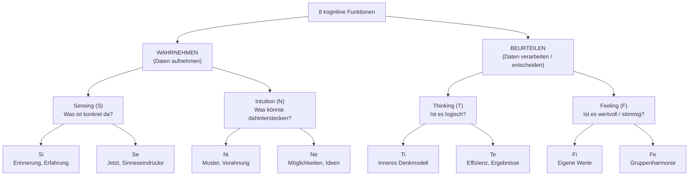
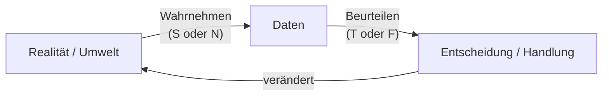
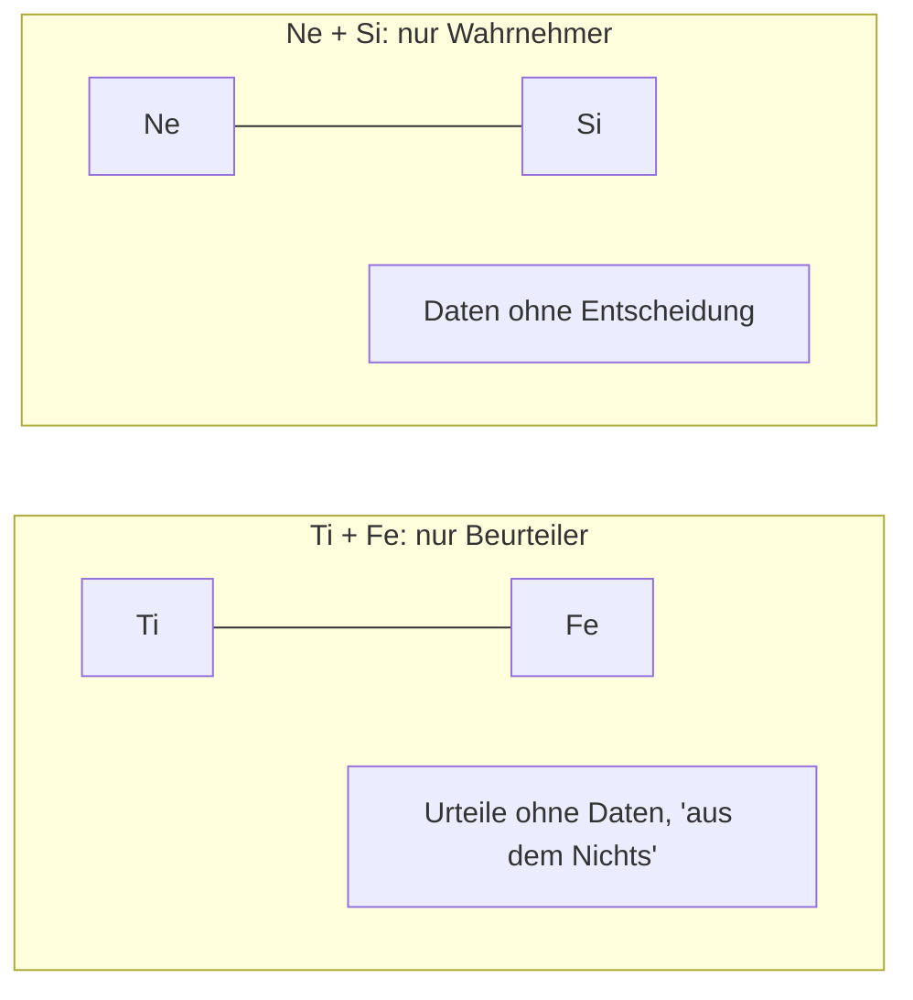
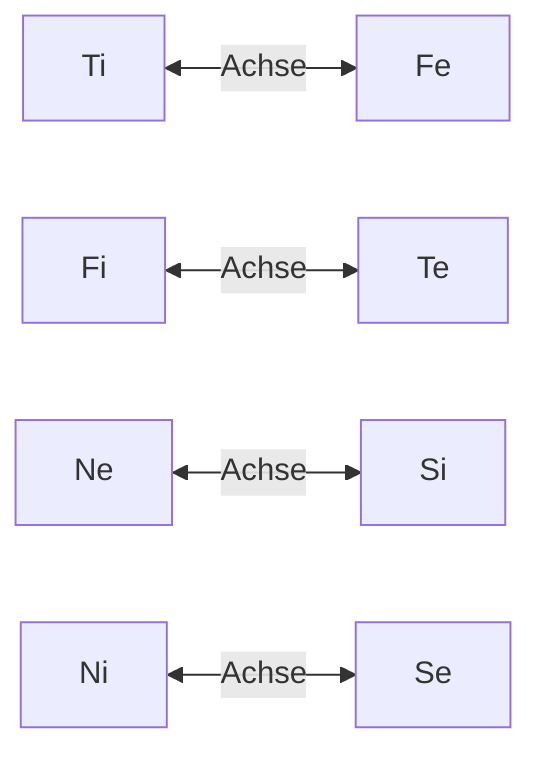
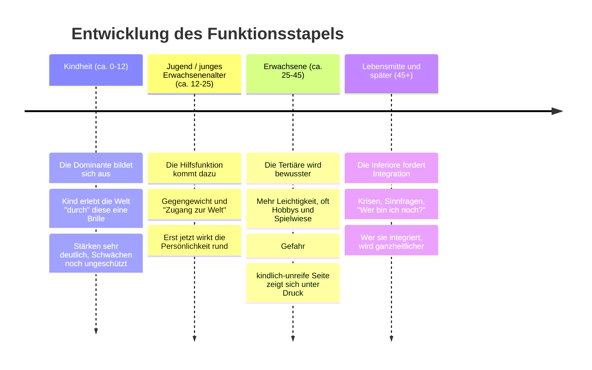
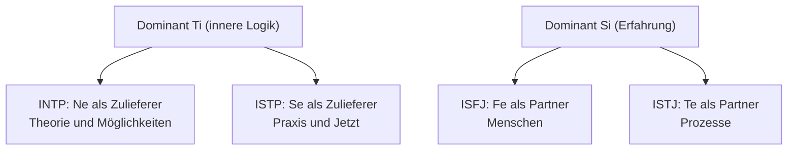

# Kognitive Funktionen verstehen

*Warum MBTI mehr ist als vier Buchstaben, und warum dein Gehirn nicht einfach „zwei Entscheider" haben kann.*

---

## 1. Das Missverständnis, das fast jeder hat

Die meisten lernen MBTI über die vier Buchstaben: **I/E, S/N, T/F, J/P**. Man bekommt „INTP", liest ein Profil und denkt: *„Stimmt, das bin ich."* Das erklärt aber nicht, **warum** ein INTP so tickt und wieso er sich von einem ISTP unterscheidet.

Der Schlüssel sind die **kognitiven Funktionen**. Sie stammen ursprünglich von C. G. Jung. Der Grundgedanke ist erstaunlich einfach:

> Dein Kopf macht immer zwei verschiedene Dinge: **Er nimmt Informationen auf** (*Wahrnehmen*) und **er entscheidet, was er damit macht** (*Beurteilen*).

Der häufigste Fehler (auch bei mir): alle Funktionen in einen Topf werfen. Dabei gibt es **vier Datenaufnehmer** und **vier Datenverarbeiter**, jeweils in einer **nach innen** (introvertiert) und einer **nach außen** (extravertiert) gerichteten Variante. Das ergibt **8 Funktionen**.

**Merkhilfe:** S und N sind **Wahrnehmer** (Input). T und F sind **Beurteiler** (Verarbeitung). Das kleine **i** oder **e** sagt nur, **wohin** die Funktion blickt: **i** = nach innen (Gedankenwelt), **e** = nach außen (Welt und Menschen).

---

## 2. Die 8 Funktionen an einem Beispiel

Stell dir vor: **Ein guter Freund erzählt dir, dass er kündigen und ein Start-up gründen will.** So reagiert jede Funktion:

| Funktion | Typische innere Reaktion |
| --- | --- |
| **Se** | „Er sitzt aufrecht, die Augen leuchten, er redet schnell. Er meint es ernst, *jetzt* gerade." |
| **Si** | „Das erinnert mich an letztes Mal, als er so etwas plante. Und wie war das bei anderen, die gekündigt haben?" |
| **Ne** | „Spannend! Er könnte auch ein Sabbatical machen, oder erst nebenbei starten, oder mit jemandem gründen …" |
| **Ni** | „Ich habe das Gefühl, das endet in Erschöpfung. Das Bild fügt sich still zusammen, ich kann es nur nicht gleich begründen." |
| **Te** | „Wie viel Kapital hat er? Wie lange reicht das? Gibt es einen Plan mit Zahlen und Meilensteinen?" |
| **Ti** | „Ist seine Annahme logisch konsistent? Wo ist die Lücke in seinem Argument?" |
| **Fe** | „Wie sieht das seine Familie? Wie fühlt sich sein Team? Wie spreche ich das an, ohne ihn zu verletzen?" |
| **Fi** | „Passt das wirklich zu *ihm*? Ist das authentisch oder will er nur jemandem etwas beweisen?" |

Jeder Mensch nutzt im Alltag alle acht, aber **in einer festen Rangfolge**. Die vier wichtigsten bilden deinen **Funktionsstapel (Stack)**.

---

## 3. Warum es nicht beliebig kombinierbar ist: Die zwei Gesetze der Balance

Dein Funktionsstapel ist wie ein **Gyroskop**: Damit die Psyche nicht „kippt", gelten zwei Baugesetze für die **ersten beiden Funktionen**.

### Gesetz 1: Innen und außen müssen sich abwechseln

Die Dominante und die Hilfsfunktion haben **entgegengesetzte Ausrichtung**. Ist die erste introvertiert (nach innen), muss die zweite extravertiert sein. Sonst wäre man in der eigenen Gedankenwelt eingeschlossen.

### Gesetz 2: Eine Wahrnehmungs- und eine Beurteilungsfunktion

Du brauchst **etwas, das Daten holt**, und **etwas, das Daten bewertet**. Zwei Beurteiler (z. B. Ti + Fe) wären zwei Entscheidungsmaschinen ohne Rohstoff. Zwei Wahrnehmer (z. B. Ne + Si) wären Datensammler, die nie etwas entscheiden.

Fehlt eine Hälfte, bricht der Kreislauf:

**Wichtige Präzisierung:** Ti + Fe scheitert an **Gesetz 2** (beide beurteilen), obwohl sie sich in der Ausrichtung ergänzen würden (i und e). Ti + Fi scheitert an **beiden Gesetzen**. Deshalb steht neben einem Ti **immer** ein Ne oder Se.

### Die „Wippen": feste Gegenpole

Jede Funktion hat einen **Schatten-Gegenpol**, der im Stapel erst weiter unten auftaucht:

### Das Bauschema jedes Stapels

1. **Dominante** (frei wählbar aus den 8)
2. **Hilfsfunktion**: gegensätzliche Ausrichtung, andere Funktionsart (Wahrnehmen ↔ Beurteilen)
3. **Tertiäre** = Gegenpol der **Hilfsfunktion**
4. **Inferiore** = Gegenpol der **Dominanten**

Beispiel INTP: Ti (dom) → Ne (hilf) → **Si** (Gegenpol von Ne) → **Fe** (Gegenpol von Ti). Daraus entsteht **Ti – Ne – Si – Fe**.

**Praxistipp zum Buchstaben-Code:** Der **letzte Buchstabe (J/P)** zeigt, welche Funktion **nach außen** gerichtet ist. J = extravertierte Funktion ist ein Beurteiler (Te/Fe); P = sie ist ein Wahrnehmer (Ne/Se). Bei Introvertierten ist das die Hilfsfunktion, bei Extravertierten die Dominante.

---

## 4. Die Entwicklung über die Lebensspanne

Nach der klassischen Theorie entwickeln sich die Funktionen **nacheinander**, nicht gleichzeitig. Die Altersangaben sind grobe Richtwerte, keine harten Grenzen.

**Was bedeutet das praktisch?**

- **Kinder** wirken oft sehr „einseitig". Ein Ti-Kind zerlegt alles und fragt tausendmal „Warum?", kann aber vielleicht noch nicht gut kooperieren.
- **Jugendliche** suchen intensiv, **wie sie wirken** und wie sie die Dominante in der Welt einsetzen können (das ist die Hilfsfunktion).
- **Erwachsene** erleben ihr Profil oft als „ausgewogener" als in der Jugend. Das ist keine Charakteränderung, sondern **Reifung der unteren Funktionen**.
- **Unter Stress** („Grip"): Die Inferiore übernimmt unkontrolliert, und man verhält sich plötzlich untypisch (z. B. ein sachlicher Typ wird emotional-explosiv).

---

## 5. Sechs Typen im Vergleich

| Typ | Dominant | Hilfs | Tertiär | Inferior |
| --- | --- | --- | --- | --- |
| **ENTP** | Ne | Ti | Fe | Si |
| **INTP** | Ti | Ne | Si | Fe |
| **ISFJ** | Si | Fe | Ti | Ne |
| **ISTJ** | Si | Te | Fi | Ne |
| **ENTJ** | Te | Ni | Se | Fi |
| **ISTP** | Ti | Se | Ni | Fe |

### ENTP: Ne – Ti – Fe – Si

**Kindheit:** Das Kind ist ein Ideensprudel: „Was wäre, wenn …?" Alles ist ein Spielplatz aus Möglichkeiten, Routinen sind der Feind. **Jugend:** Ti kommt dazu: Der Jugendliche beginnt, seine Ideen logisch zu prüfen und gewinnt Diskussionen aus Spaß. **Erwachsen:** Fe entwickelt sich: Er lernt, Menschen mitzunehmen, zu begeistern und zu moderieren. **Auswirkung:** Fängt vieles an, Fertigstellen und Details (inferiores Si: Pflege, Routine, Erfahrungsdaten) sind die Schwäche.

### INTP: Ti – Ne – Si – Fe

**Kindheit:** Das Kind baut innere Systeme: „Ich will verstehen, wie das *wirklich* funktioniert." **Jugend:** Ne liefert Material: Viele Interessen, viele Theorien, die er „durchdenkt". **Erwachsen:** Si baut Erinnerungsstabilität auf: Verlässlichere Routinen, Wissenstiefe. **Auswirkung:** Wirkt nach außen oft still, innen läuft ein ständiger Denkprozess. Die Schwäche (inferiores Fe) ist das Lesen und Bedienen sozialer Erwartungen.

> **ENTP und INTP haben dieselben vier Funktionen, nur in anderer Reihenfolge.** Der ENTP *sammelt* Möglichkeiten und prüft sie dann; der INTP *baut* ein Modell und füttert es mit Möglichkeiten.

### ISFJ: Si – Fe – Ti – Ne

**Kindheit:** Das Kind prägt sich Vertrautes, Rituale und Gewohnheiten ein, merkt sich erstaunlich viel (Geburtstage, wer was mag). **Jugend:** Fe tritt hinzu: Es kümmert sich um andere, vermittelt, spürt die Stimmung im Raum. **Erwachsen:** Ti entsteht: Es lernt, auch eigene Logik und Grenzen zu formulieren. **Auswirkung:** Verlässlich, fürsorglich, bewahrend. Unter Stress überfluten Katastrophen-Szenarien (inferiores Ne): „Was, wenn alles schiefgeht?"

### ISTJ: Si – Te – Fi – Ne

**Kindheit:** Wie beim ISFJ: Ordnung, Regeln, Bewährtes geben Halt. **Jugend:** Te kommt hinzu: Er organisiert, plant, setzt Standards und erledigt Aufgaben effizient. **Erwachsen:** Fi wird bewusster: Eigene Werte und Überzeugungen werden klarer, wirken aber oft leise. **Auswirkung:** Pflichtbewusst, verlässlich, strukturiert. Veränderungen und offene Möglichkeiten (inferiores Ne) bereiten Unbehagen.

> **ISFJ vs. ISTJ:** Gleiche Dominante (Si), aber andere Hilfsfunktion. Der ISFJ pflegt Menschen (**Fe**), der ISTJ pflegt Prozesse und Ergebnisse (**Te**).

### ENTJ: Te – Ni – Se – Fi

**Kindheit:** Das Kind übernimmt Verantwortung, organisiert Spiele, gibt Anweisungen. **Jugend:** Ni schenkt Weitblick: Es entwickelt Visionen und strategisches Denken. **Erwachsen:** Se wird greifbarer: Mehr Präsenz im Hier und Jetzt, mehr Handlungslust. **Auswirkung:** Zielorientiert, führend, effizient. Die Schwäche (inferiores Fi): eigene Gefühle und Werte werden spät wahrgenommen, im Stress „bricht" es emotional durch.

### ISTP: Ti – Se – Ni – Fe

**Kindheit:** Das Kind schraubt, probiert, zerlegt Dinge und will wissen, **wie** sie funktionieren. **Jugend:** Se kommt hinzu: Hands-on, körperliches Können, schnelle Reaktion in realen Situationen. **Erwachsen:** Ni sorgt für Intuition: Ein „Bauchgefühl" für Muster und Entwicklungen. **Auswirkung:** Pragmatisch, kühl-analytisch, handlungsstark. Soziale Harmonie und Erwartungen (inferiores Fe) kosten Energie.

> **INTP vs. ISTP:** Beide haben Ti an der Spitze. Der INTP füttert es mit **Ne** (Ideen, Theorie), der ISTP mit **Se** (Realität, Praxis).

---

## 6. Was du daraus mitnehmen kannst

1. **Der Buchstaben-Code ist eine Kurzschrift.** Dahinter stehen immer vier Funktionen in einer festen Rangfolge.
2. **Dominante und Hilfsfunktion wechseln sich ab:** innen/außen **und** Wahrnehmen/Beurteilen.
3. **Tertiäre und Inferiore sind die Gegenpole** der Hilfsfunktion und der Dominanten.
4. **Entwicklung heißt Reihenfolge:** Dominante → Hilfsfunktion → Tertiäre → Inferiore.
5. **Wenn dir bei einer Person der Typ nicht klar ist**, frag nicht „Ist er eher T oder F?", sondern: *Wie nimmt er Informationen auf? Was entscheidet er zuerst, innen oder außen?*

**Ehrliche Einordnung:** Die kognitiven Funktionen sind ein **Denkmodell**, keine wissenschaftlich bestätigte Theorie. Die empirische Forschung (z. B. zur Test-Retest-Stabilität oder zur Existenz klar getrennter Typen) sieht MBTI kritisch. Die Entwicklungsphasen sind ein theoretisches Konzept. Als **Werkzeug, um Menschen und eigene Muster zu beschreiben**, kann es trotzdem sehr hilfreich sein, solange man es als Landkarte und nicht als Wahrheit nutzt.