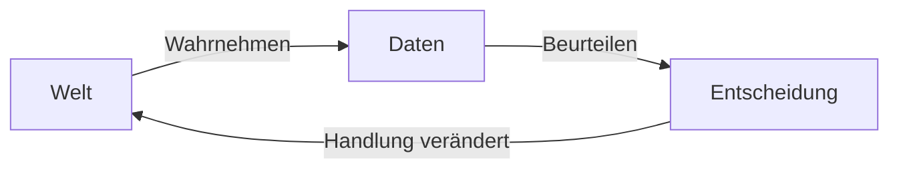
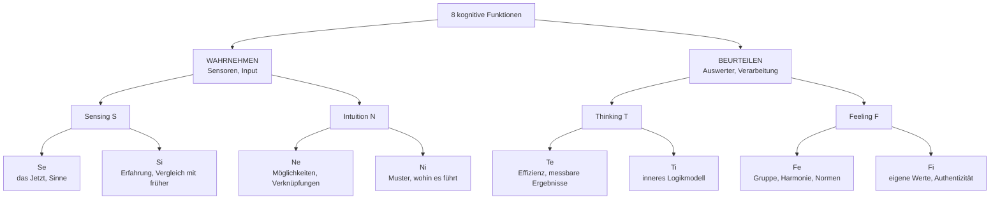
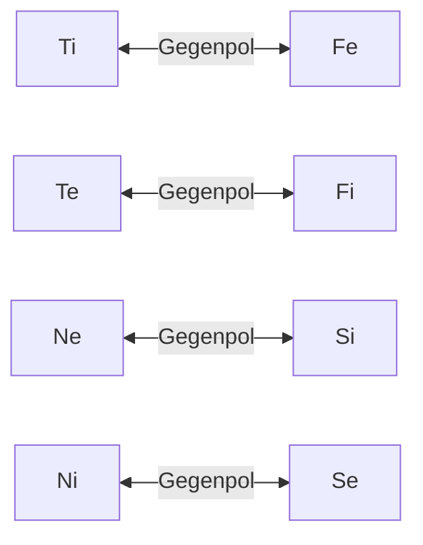
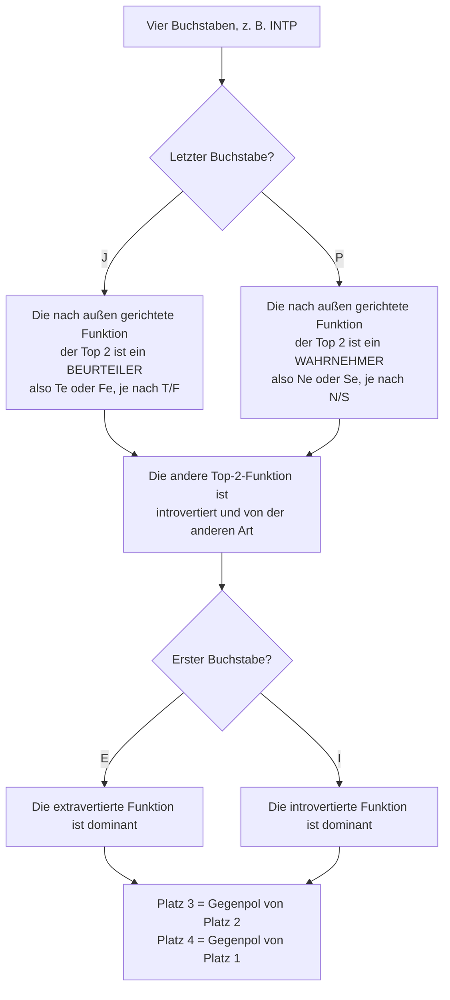
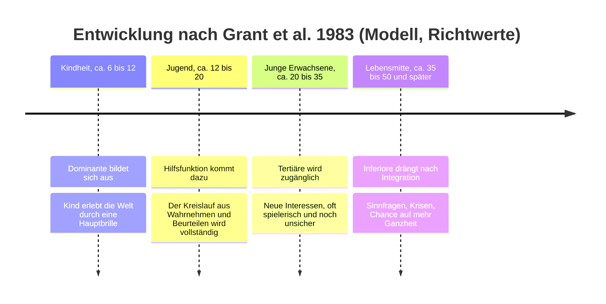
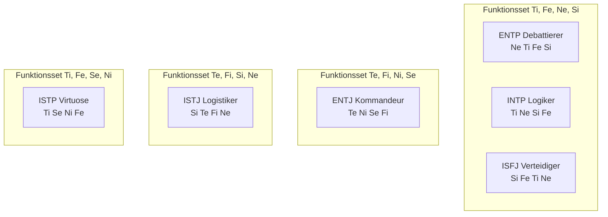
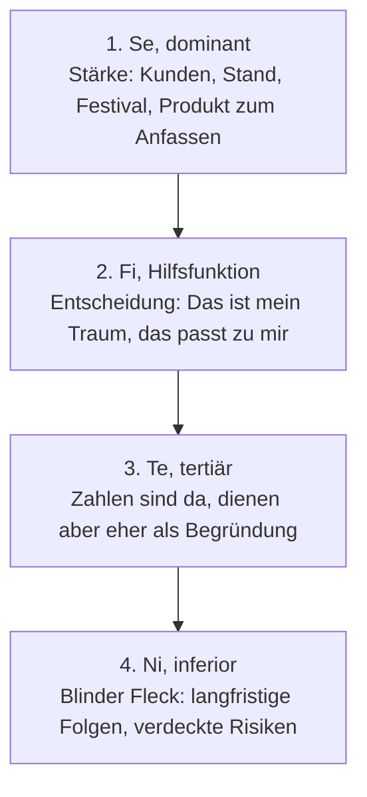
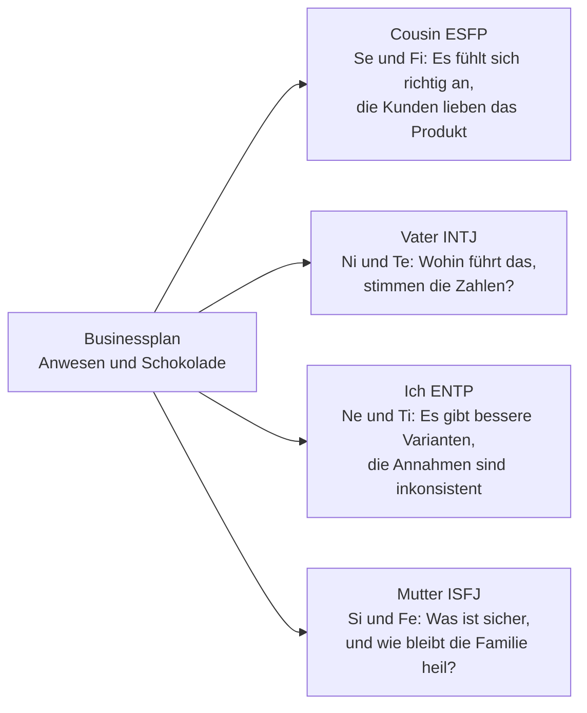

# Kognitive Funktionen verstehen

*Was hinter den vier Buchstaben steckt, wie das Modell gebaut ist und warum man es durchschauen kann, ohne es glauben zu müssen.*

---

## 0. Bevor es losgeht: Was dieser Text ist (und was nicht)

Vielleicht kennst du das: Du hast schon vielen Leuten in deinem Umfeld einen MBTI-Typ zugeordnet, und meistens passt es erstaunlich gut. Aber auf die Frage *„Warum haben ENTP und INTP angeblich dieselben Funktionen, und ENTJ und INTP keine einzige gemeinsame?"* fällt dir keine Antwort ein. Und Ti, Te, Ni, Ne verschwimmen zu einem Buchstabensalat.

Dieser Text baut das Modell von unten auf, Schritt für Schritt, sodass du es am Ende **selbst herleiten** kannst, statt es auswendig zu lernen.

Gleich vorweg die ehrliche Einordnung, weil sie den ganzen Text prägt:

> Die kognitiven Funktionen sind ein **theoretisches Modell**, das auf C. G. Jung (1921) zurückgeht und später von Isabel Briggs Myers und anderen erweitert wurde. Ein Teil davon ist empirisch untersucht, der größere Teil nicht. Ich markiere im Text, was **Modellannahme** ist und wo es **Forschung** gibt. Ein Modell kann nützlich sein, ohne wahr zu sein. Die Frage ist dann: Ist es *in sich schlüssig*, und hilft es, Dinge zu sehen, die man sonst übersieht?

---

## 1. Die Grundidee: Jeder Kopf hat zwei Aufgaben

Stell dir vor, du stehst an einer Straße und willst sie überqueren.

1. Du **siehst** ein Auto, schätzt seine Geschwindigkeit, hörst ein zweites hinter der Kurve.
2. Du **entscheidest**: warten.

Das sind zwei grundverschiedene Tätigkeiten. Die erste **nimmt Daten auf**, die zweite **verarbeitet sie zu einem Urteil**. Jung nannte das:

- **Wahrnehmen** (Perceiving): Was ist da? Was kommt herein?
- **Beurteilen** (Judging): Was mache ich damit? Was ist richtig, wichtig, logisch?

Wer das einmal verstanden hat, hat den häufigsten Stolperstein schon hinter sich: **Nicht alle Funktionen machen dasselbe.** Vier sind Sensoren, vier sind Auswerter. Wer Ne und Te verwechselt, verwechselt einen Sensor mit einem Auswerter.

### Zwei Arten wahrzunehmen, zwei Arten zu beurteilen

Für jede der beiden Aufgaben gibt es nach Jung zwei Varianten:

| Aufgabe | Variante | Leitfrage |
| --- | --- | --- |
| Wahrnehmen | **Sensing (S)** | Was ist konkret, nachweisbar da? |
| Wahrnehmen | **Intuition (N)** | Was steckt dahinter, was könnte daraus werden? |
| Beurteilen | **Thinking (T)** | Ist es logisch, stimmig, wirksam? |
| Beurteilen | **Feeling (F)** | Ist es wertvoll, menschlich richtig? |

Feeling heißt hier übrigens nicht „emotional", sondern „urteilt nach Werten". Ein F-Urteil kann völlig ruhig und rational begründet sein.

### Und dann die Richtung: innen oder außen

Jede dieser vier Varianten kann **nach außen** (extravertiert, e) oder **nach innen** (introvertiert, i) gerichtet sein. Das kleine i oder e sagt also nicht, ob jemand gesellig ist, sondern **wo die Funktion ihr Material holt bzw. ihren Maßstab hernimmt**.

2 Aufgaben × 2 Varianten × 2 Richtungen = **8 Funktionen**.

---

## 2. Die acht Funktionen im Alltag

### Die vier Wahrnehmer: Du kommst in eine fremde Stadt

| Funktion | Was sie bemerkt |
| --- | --- |
| **Se** | Der Geruch vom Bäcker, das Kopfsteinpflaster, die Straßenmusik. Sie ist ganz im Moment und reagiert schnell. |
| **Si** | „Das erinnert mich an Lissabon. Damals war die Altstadt abends zu laut, ich nehme lieber das Hotel am Rand." Sie vergleicht mit gespeicherter Erfahrung. |
| **Ne** | „Da drüben ist ein Flohmarkt, wir könnten auch die Fähre nehmen, oder einfach den Bus bis Endstation fahren und schauen, was kommt." Sie sieht Abzweigungen. |
| **Ni** | „Dieses Viertel kippt gerade. In fünf Jahren ist das hier teuer." Sie verdichtet Eindrücke zu einer Richtung, oft ohne den Weg dahin benennen zu können. |

### Die vier Beurteiler: Die Gruppe sucht ein Restaurant

| Funktion | Wie sie entscheidet |
| --- | --- |
| **Te** | „Nächstes Lokal mit über 4,5 Sternen, das jetzt noch offen hat. Ich reserviere." Maßstab: externe, überprüfbare Kriterien. |
| **Ti** | „Moment, was sind eigentlich unsere Kriterien? Preis, Entfernung und Qualität widersprechen sich teilweise." Maßstab: innere logische Konsistenz. |
| **Fe** | „Anna isst kein Fleisch, Tom hatte einen harten Tag. Was passt für alle?" Maßstab: das Befinden der Gruppe. |
| **Fi** | „In das Lokal mit der Massentierhaltung gehe ich nicht, egal wie gut es bewertet ist." Maßstab: die eigenen Werte. |

Jeder Mensch kann alles davon. Das Modell behauptet nur: **Jeder hat eine feste Rangfolge**, in der er diese Funktionen bevorzugt und gut beherrscht.

---

## 3. Ein Plan, acht Reaktionen

Jetzt alle acht auf einen Fall angewendet. Jemand aus der Familie stellt einen Businessplan vor: **Ein abgelegenes Anwesen kaufen und dort Schokolade herstellen.**

Achte darauf, dass die Wahrnehmer etwas **bemerken**, während die Beurteiler etwas **bewerten**.

### Wahrnehmer: „Was sehe ich an diesem Plan?"

| Funktion | Typische innere Reaktion |
| --- | --- |
| **Se** | „Das Gebäude, der Duft von Kakao, Kunden am Stand, die probieren. Ich sehe das direkt vor mir, und es fühlt sich lebendig an." |
| **Si** | „Wie lief es bei Leuten, die wir kennen und gegründet haben? Was ist sicher und bewährt, was gibt man dafür auf?" |
| **Ne** | „Warum gleich kaufen? Man könnte erst eine Produktionsküche mieten, nur auf Festivals verkaufen, oder einen Onlineshop testen." |
| **Ni** | „Abgelegen heißt: lange Lieferwege, schwer Personal zu finden, Abhängigkeit vom Festivalsommer. Ich sehe, wo das in drei Jahren steht." |

### Beurteiler: „Was halte ich davon?"

| Funktion | Typische innere Reaktion |
| --- | --- |
| **Te** | „Welcher Umsatz pro Monat ist realistisch? Was kostet das Anwesen inklusive Sanierung? Wann ist der Break-even?" |
| **Ti** | „Die Annahme 'Festivalumsatz gilt das ganze Jahr' ist nicht konsistent mit 'Festivals finden im Sommer statt'." |
| **Fe** | „Wie reagiert die Familie, wenn ich Bedenken äußere? Wie sage ich das, ohne ihn zu entmutigen?" |
| **Fi** | „Das ist sein Traum. Es passt zu ihm, es ist echt, und das zählt." |

Kein Eintrag ist „richtig". Jeder sieht einen echten Teil des Bildes. Wir kommen auf genau diesen Plan in Abschnitt 7 zurück.

---

## 4. Vom Baukasten zum Stapel: Die Konstruktionsregeln

Bisher haben wir acht Bausteine. Ein Typ ist eine **geordnete Auswahl von vier** davon, der **Funktionsstapel (Stack)**:

1. **Dominante**: die Hauptfunktion, die man am meisten und am selbstverständlichsten nutzt
2. **Hilfsfunktion** (Auxiliar): die Unterstützerin
3. **Tertiäre**: entwickelt sich später, oft verspielt oder unsicher
4. **Inferiore**: die schwächste, am wenigsten bewusste Funktion

Die Reihenfolge ist nicht beliebig. Das Modell gibt dafür Regeln vor. Wichtig: Das sind **Konstruktionsregeln des Modells**, keine Naturgesetze, die jemand im Gehirn gemessen hätte. Ich nenne bei jeder Regel, woher sie kommt und warum sie innerhalb des Modells Sinn ergibt.

### Regel 1: Unter den Top 2 ist ein Wahrnehmer und ein Beurteiler

*Herkunft: Jung selbst (Psychologische Typen, 1921). Er beschreibt die Hilfsfunktion als in ihrem Wesen von der Hauptfunktion verschieden: Ist die Hauptfunktion urteilend („rational"), ist die Hilfsfunktion wahrnehmend („irrational") und umgekehrt.*

**Warum das im Modell Sinn ergibt:** Erinnere dich an den Kreislauf aus Abschnitt 1. Zwei Beurteiler an der Spitze, z. B. Ti und Fe, wären zwei Auswerter ohne Sensor: Urteile ohne frisches Material. Zwei Wahrnehmer, z. B. Ne und Si, wären Sensoren ohne Auswertung: endlos Daten, keine Entscheidung. Die Regel stellt sicher, dass die zwei stärksten Funktionen zusammen einen vollständigen Kreislauf bilden.

### Regel 2: Unter den Top 2 ist eine nach innen und eine nach außen gerichtet

*Herkunft: Ausformuliert vor allem von Isabel Briggs Myers (Gifts Differing, 1980). Bei Jung ist dieser Punkt weniger eindeutig.*

**Warum das im Modell Sinn ergibt:** Zwei introvertierte Funktionen an der Spitze (z. B. Ti und Ni) hätten keinen bevorzugten Kanal zur Außenwelt. Zwei extravertierte (z. B. Ne und Te) keinen bevorzugten Ort zum Verarbeiten und Rückversichern. Die Regel sorgt dafür, dass jeder Typ einen gut ausgebauten Zugang zu **beiden** Welten hat.

### Regel 3 und 4: Die unteren Plätze sind die Gegenpole

*Herkunft: Spätere Autoren, u. a. Grant, Thompson & Clarke (1983) und John Beebe. Hier unterscheiden sich die Schulen teilweise.*

Jede Funktion hat einen festen Gegenpol: gleiche Aufgabe, andere Variante, andere Richtung.

- **Tertiäre** = Gegenpol der Hilfsfunktion
- **Inferiore** = Gegenpol der Dominanten

**Warum das im Modell Sinn ergibt:** Die Inferiore ist genau das, was die Dominante systematisch ausblendet. Wer die Welt durch inneres Logikmodell (Ti) betrachtet, hat für das Lesen der Gruppenstimmung (Fe) am wenigsten Aufmerksamkeit übrig. Das Modell beschreibt Persönlichkeit damit als Kompromiss: Eine Stärke hat immer einen blinden Fleck auf der gegenüberliegenden Seite.

### Ein Konsistenzcheck, den du selbst machen kannst

Wie viele Stacks erlauben diese Regeln?

- 8 Möglichkeiten für die Dominante
- Für die Hilfsfunktion bleiben nach Regel 1 und 2 genau **2** übrig (z. B. bei Ti: nur Ne oder Se)
- Tertiäre und Inferiore sind dann zwingend festgelegt

8 × 2 = **16 Stacks**. Und es gibt genau 16 Buchstabenkombinationen aus I/E, S/N, T/F, J/P. Die Regeln erzeugen also exakt so viele Typen, wie der Code darstellen kann, und jeder Code entspricht genau einem Stack. Das beweist nicht, dass das Modell stimmt, aber es zeigt, dass es **in sich geschlossen** ist.

### Den Stack aus den Buchstaben ableiten

Du musst die Stacks nicht auswendig lernen. Ein kleiner Algorithmus reicht:

**Durchgerechnet für INTP:**

1. P: Die extravertierte Funktion ist ein Wahrnehmer. N, also **Ne**.
2. Die andere ist ein introvertierter Beurteiler. T, also **Ti**.
3. I: Die introvertierte ist dominant. Also **Ti, Ne**.
4. Gegenpol von Ne = **Si**, Gegenpol von Ti = **Fe**.

Ergebnis: **Ti – Ne – Si – Fe**.

Die Tücke steckt im J/P: Bei Introvertierten beschreibt der letzte Buchstabe die *Hilfsfunktion*, nicht die Dominante. Ein INTP ist im Kern ein Beurteiler (Ti), obwohl „P" draufsteht. Das ist einer der Hauptgründe, warum die Buchstaben so verwirren.

### Wie belastbar ist das alles?

Hier lohnt sich der nüchterne Blick:

- **Die vier Skalen** (E/I, S/N, T/F, J/P) sind gut untersucht. Sie korrelieren deutlich mit vier der Big-Five-Faktoren: E/I mit Extraversion, S/N mit Offenheit, T/F mit Verträglichkeit, J/P mit Gewissenhaftigkeit (McCrae & Costa, 1989).
- **Zwillingsstudien** zeigen, dass diese Skalen einen deutlichen genetischen Anteil haben, in ähnlicher Größenordnung wie andere Persönlichkeitsmerkmale (Bouchard & Hur, 1998, mit getrennt aufgewachsenen Zwillingen). Das betrifft aber die **Skalen**, nicht die Funktionen oder den Stack.
- **Typen als klare Kategorien** sind schwach belegt. Die Testwerte sind meist normalverteilt statt zweigipflig (Bess & Harvey, 2002), und bei Wiederholung nach wenigen Wochen landet ein erheblicher Teil der Getesteten in einem anderen Typ (Pittenger, 1993, 2005). Wer knapp an der Grenze zwischen T und F liegt, „ist" nicht eindeutig eins von beiden.
- **Die Funktionsdynamik**, also Stack, Dominante, Inferiore und die Regeln oben, ist empirisch kaum gestützt. Reynierse (2009) hat die verfügbaren Daten ausgewertet und findet keine überzeugende Bestätigung.

Kurz: Die Messung hinter den Buchstaben ist halbwegs solide, die Architektur der Funktionen ist **Theorie**. Der Rest dieses Textes bewegt sich innerhalb dieser Theorie. Lies ihn wie die Dokumentation eines Systems, dessen Spezifikation konsistent ist, dessen Übereinstimmung mit der Realität aber nicht abschließend getestet wurde.

---

## 5. Wie sich der Stack über das Leben entwickelt

Die bekannteste Entwicklungsthese stammt von Grant, Thompson & Clarke (1983). Sie ist **reine Theorie**, die Altersangaben sind grobe Richtwerte.

### Kindheit: eine Brille

Kinder wirken laut Modell oft sehr einseitig, weil die Dominante allein arbeitet. Ein Ne-Kind springt von Idee zu Idee, ein Si-Kind besteht auf dem gewohnten Abendritual, ein Ti-Kind fragt zum zwanzigsten Mal „Aber warum?".

### Jugend: Die Hilfsfunktion schließt den Kreislauf

In der Jugend entwickelt sich die Hilfsfunktion. Sie bringt der Dominanten genau das, was ihr fehlt, und zwar doppelt:

- **Die andere Aufgabe:** Ist die Dominante ein Beurteiler, liefert die Hilfsfunktion das Datenmaterial. Ist die Dominante ein Wahrnehmer, liefert die Hilfsfunktion die Fähigkeit, auszuwählen und zu entscheiden.
- **Die andere Richtung:** Introvertierte bekommen einen verlässlichen Kanal nach außen, Extravertierte einen Ort zum Nachdenken nach innen.

Zwei Beispiele:

- **Ein ENTP-Jugendlicher** (Ne dominant) hatte als Kind hundert Ideen und hat keine zu Ende gebracht. Mit Ti bekommt er Kriterien: Er beginnt, Ideen zu prüfen, zu verwerfen und Argumente zu bauen. Diskussionen werden zum Sport.
- **Ein INTP-Jugendlicher** (Ti dominant) hat als Kind lange über wenigen Dingen gegrübelt. Mit Ne holt er sich Material von außen: neue Themen, neue Theorien, neue Leute mit interessanten Gedanken. Sein Denksystem bekommt Futter.

### Erwachsene: Tertiäre und Inferiore

Im Erwachsenenalter wird laut Modell die Tertiäre zugänglicher, oft über Hobbys oder neue Rollen. Später drängt die Inferiore in den Vordergrund. Jung verband diese Phase mit der Lebensmitte und dem, was er Individuation nannte: das Integrieren der vernachlässigten Seiten.

**Was die Forschung dazu sagt:** Dass Menschen mit dem Alter im Schnitt ausgeglichener werden, ist gut belegt. Eine große Metaanalyse zeigt, dass Gewissenhaftigkeit, Verträglichkeit und emotionale Stabilität vom jungen bis ins mittlere Erwachsenenalter zunehmen (Roberts, Walton & Viechtbauer, 2006). Dass dies in der **Reihenfolge des Funktionsstapels** geschieht, ist dagegen nicht belegt. Das Modell liefert eine Erzählung für einen echten Effekt, aber nicht den Beweis für den Mechanismus.

### Stress: Wenn die Inferiore übernimmt

Naomi Quenk (2002) beschreibt den „Grip": Unter starkem Stress oder Erschöpfung übernimmt die Inferiore, aber in unreifer, übertriebener Form. Man erkennt sich selbst kaum wieder.

| Dominant | Inferior | So kann der Grip aussehen |
| --- | --- | --- |
| Ne (ENTP) | Si | Hypochondrie, Fixierung auf Körpersignale, kleinliches Festhalten an Details |
| Ti (INTP, ISTP) | Fe | Plötzliche emotionale Ausbrüche, das Gefühl, von niemandem gemocht zu werden |
| Si (ISFJ, ISTJ) | Ne | Katastrophenszenarien: „Was, wenn alles schiefgeht?" |
| Te (ENTJ) | Fi | Überwältigt von Gefühlen, die man sonst nicht zulässt, Gefühl der Wertlosigkeit |
| Se (ESFP) | Ni | Düstere Vorahnungen, Deutung von Zeichen, Tunnelblick auf eine negative Zukunft |
| Ni (INTJ) | Se | Exzessives Sinnesverhalten: Essen, Shoppen, Serien, übertriebener Fokus auf Details |

---

## 6. Sechs Typen im Vergleich

Die Spitznamen stammen von 16Personalities und sind im deutschsprachigen Raum am bekanntesten. Kleine Fußnote: 16Personalities selbst arbeitet gar nicht mit kognitiven Funktionen, sondern mit einem Skalenmodell, das den Big Five ähnelt.

| Typ | Spitzname | Dominant | Hilfs | Tertiär | Inferior |
| --- | --- | --- | --- | --- | --- |
| **ENTP** | Debattierer | Ne | Ti | Fe | Si |
| **INTP** | Logiker | Ti | Ne | Si | Fe |
| **ISFJ** | Verteidiger | Si | Fe | Ti | Ne |
| **ISTJ** | Logistiker | Si | Te | Fi | Ne |
| **ENTJ** | Kommandeur | Te | Ni | Se | Fi |
| **ISTP** | Virtuose | Ti | Se | Ni | Fe |

Bevor wir die Typen einzeln ansehen, eine Beobachtung, die die Buchstaben komplett verschleiern:

- **ENTP, INTP und ISFJ benutzen dieselben vier Funktionen**, nur in anderer Reihenfolge. Der ISFJ ist sogar die exakte Umkehrung des ENTP: Was beim ENTP oben steht, steht beim ISFJ unten.
- **INTP und ENTJ teilen keine einzige Funktion**, obwohl beide „NT" sind. Der INTP denkt mit Ti, der ENTJ mit Te. Der INTP nimmt mit Ne wahr, der ENTJ mit Ni. Die Ähnlichkeit der Buchstaben ist an dieser Stelle irreführend.

### ENTP, der Debattierer: Ne – Ti – Fe – Si

- **Kindheit (Ne):** Ein Ideensprudel. „Was wäre, wenn …?" Spielzeug wird zweckentfremdet, Regeln werden hinterfragt, Routinen langweilen.
- **Jugend (+Ti):** Die Ideen bekommen Prüfkriterien. Der Jugendliche argumentiert gern, wechselt auch mal die Seite, nur um zu sehen, ob die Gegenposition hält.
- **Erwachsen (+Fe):** Er lernt, Menschen mitzunehmen, Stimmungen zu nutzen, zu begeistern und zu moderieren.
- **Auswirkung:** Starker Starter, schwacher Finisher. Das inferiore Si (Routine, Pflege, Details, Körpersignale) bleibt die Baustelle.

### INTP, der Logiker: Ti – Ne – Si – Fe

- **Kindheit (Ti):** Will verstehen, wie etwas *wirklich* funktioniert, und gibt sich mit „Das ist halt so" nicht zufrieden. Baut innere Ordnungssysteme, oft unsichtbar für andere.
- **Jugend (+Ne):** Die Neugier geht nach außen: viele Interessen, Theorien, Gedankenexperimente. Ne liefert, Ti sortiert.
- **Erwachsen (+Si):** Wissen wird stabiler und tiefer, Routinen werden verlässlicher, bewährte Methoden gewinnen an Wert.
- **Auswirkung:** Nach außen ruhig, innen ein ständiger Prüfprozess. Ein INTP sagt lieber nichts als etwas Ungenaues. Das inferiore Fe macht soziale Erwartungen anstrengend: Small Talk wirkt wie ein Protokoll ohne Spezifikation.

> **ENTP vs. INTP:** Gleiche Funktionen, vertauschte Spitze. Der ENTP *sammelt* Möglichkeiten und prüft sie danach. Der INTP *baut* ein Modell und holt sich Möglichkeiten, um es zu testen. Im Gespräch merkt man das so: Der ENTP denkt laut und verwirft im Reden, der INTP denkt erst und redet dann.

### ISFJ, der Verteidiger: Si – Fe – Ti – Ne

- **Kindheit (Si):** Liebt Vertrautes und Rituale, merkt sich erstaunlich viel: Geburtstage, wer was mag, wie etwas „immer" war.
- **Jugend (+Fe):** Kümmert sich um andere, vermittelt, spürt die Stimmung im Raum.
- **Erwachsen (+Ti):** Lernt, eigene Gründe zu formulieren und Grenzen zu ziehen, statt nur für andere da zu sein.
- **Auswirkung:** Verlässlich, fürsorglich, bewahrend. Das inferiore Ne zeigt sich unter Stress als Kopfkino: lauter Möglichkeiten, aber nur die schlechten.

### ISTJ, der Logistiker: Si – Te – Fi – Ne

- **Kindheit (Si):** Ordnung, Regeln und Bewährtes geben Halt.
- **Jugend (+Te):** Organisiert, plant, setzt Standards, erledigt Aufgaben effizient.
- **Erwachsen (+Fi):** Eigene Werte und Überzeugungen werden bewusster, wirken aber leise.
- **Auswirkung:** Pflichtbewusst, strukturiert, belastbar. Plötzliche Veränderungen und offene Möglichkeiten (inferiores Ne) bereiten Unbehagen.

> **ISFJ vs. ISTJ:** Gleiche Dominante, andere Hilfsfunktion. Beide bauen auf Erfahrung (Si). Der ISFJ pflegt damit **Menschen** (Fe), der ISTJ **Prozesse und Ergebnisse** (Te).

### ENTJ, der Kommandeur: Te – Ni – Se – Fi

- **Kindheit (Te):** Organisiert die Spiele, verteilt Rollen, will, dass es vorangeht.
- **Jugend (+Ni):** Bekommt Weitblick. Aus „wir machen jetzt" wird „wir machen das, damit in zwei Jahren …". Strategisches Denken entsteht.
- **Erwachsen (+Se):** Mehr Präsenz im Hier und Jetzt, Lust auf Erleben, Status, Wettbewerb.
- **Auswirkung:** Zielorientiert und führungsstark. Die eigenen Gefühle (inferiores Fi) werden spät bemerkt und brechen unter Druck manchmal unkontrolliert durch.

### ISTP, der Virtuose: Ti – Se – Ni – Fe

- **Kindheit (Ti):** Schraubt, zerlegt, probiert. Will wissen, *wie* Dinge funktionieren, am liebsten mit den Händen.
- **Jugend (+Se):** Körperliches Können, Werkzeuge, schnelle Reaktion: Motorrad, Sport, Reparaturen.
- **Erwachsen (+Ni):** Ein Gespür für Muster: „Das Lager macht's nicht mehr lange", bevor es messbar ist.
- **Auswirkung:** Pragmatisch, kühl-analytisch, ruhig in Krisen. Soziale Erwartungen (inferiores Fe) kosten Energie.

> **INTP vs. ISTP:** Beide haben Ti an der Spitze, also denselben Auswerter. Der Unterschied ist der Sensor: Der INTP füttert Ti mit **Ne** (Ideen, Theorie, Möglichkeiten), der ISTP mit **Se** (Realität, Material, Jetzt). Ein INTP fragt „Wie hängt das zusammen?", ein ISTP „Wie kriege ich das zum Laufen?".

---

## 7. Fallstudie: Eine Familie und ein Schokoladen-Businessplan

Zum Schluss wird das Modell auf echte Menschen angewendet. Die Typen sind Selbst- bzw. Fremdeinschätzungen, beim Cousin ausdrücklich nur eine Vermutung.

| Person | Typ | Spitzname | Stack |
| --- | --- | --- | --- |
| Ich | ENTP | Debattierer | Ne – Ti – Fe – Si |
| Mutter | ISFJ | Verteidiger | Si – Fe – Ti – Ne |
| Vater | INTJ | Architekt | Ni – Te – Fi – Se |
| Cousin (vermutlich) | ESFP | Entertainer | Se – Fi – Te – Ni |

Die Ausgangslage: Der Cousin ist sehr erfolgreich mit Verkaufsstand und Wagen auf Festivals, hat direkten Kontakt zu Kunden und inzwischen sogar Mitarbeiter. Jetzt legt er einen Businessplan vor: Kauf eines weit abgelegenen Anwesens, Schokoladenproduktion. Mich und meinen Vater überzeugt der Plan nicht. Die Zahlen wirken geschönt, das Bild ist durchweg positiv, und das Risiko, dass die Erwerbsminderungsrente mit der Gründung wegfallen könnte, taucht nicht auf.

### Was das Modell über den Plan sagt

Lies den Stack des ESFP von oben nach unten und lege ihn neben den Plan:

- **Se (dominant)** erklärt den Erfolg am Festivalstand. Präsenz, direktes Reagieren auf Menschen, das Gespür für das, was im Moment funktioniert: Das ist keine Schwäche des Plans, das ist sein stärkstes Fundament.
- **Fi (Hilfsfunktion)** trifft die Entscheidung: Das Anwesen, die eigene Manufaktur, das fühlt sich richtig und authentisch an. Für Fi ist der Plan ein Stück Identität. Kritik am Plan kann sich deshalb wie Kritik an der Person anfühlen.
- **Te (tertiär)** ist laut Modell vorhanden, aber weniger ausgereift. Tertiäre Funktionen arbeiten oft im Dienst der oberen beiden: Die Zahlen werden dann nicht genutzt, um die Entscheidung zu *prüfen*, sondern um eine bereits getroffene Fi-Entscheidung zu *begründen*. Das passt zum Eindruck „geschönt".
- **Ni (inferior)** ist genau die Funktion, die fragt: „Wohin führt das in fünf Jahren? Was übersehe ich?" Abgelegene Lage, Personal, Saisonabhängigkeit, Wegfall der Rente: Das sind typische Ni-Themen, also genau der blinde Fleck.

### Warum ausgerechnet Vater und ich skeptisch sind

Lege die Stacks nebeneinander:

| Platz | Cousin ESFP | Vater INTJ |
| --- | --- | --- |
| 1 | **Se** | **Ni** |
| 2 | **Fi** | **Te** |
| 3 | Te | Fi |
| 4 | Ni | Se |

Der INTJ ist die **exakte Umkehrung** des ESFP. Was beim Cousin unten liegt (Te, Ni), sind die beiden stärksten Funktionen des Vaters. Er sieht sofort die Entwicklungslinie (Ni) und will belastbare Zahlen (Te). Umgekehrt unterschätzt er vermutlich, was der Cousin am stärksten kann: Se, den Moment, die Kunden.

Ich als ENTP komme auf anderem Weg zum gleichen Ergebnis:

- **Ne** sieht sofort Alternativen: „Warum kaufen? Erst mieten. Erst Onlineshop. Erst eine Wintersaison testen."
- **Ti** findet die logischen Brüche: Festivalumsatz ist saisonal, die Hochrechnung aber nicht.

Und meine Mutter? Als ISFJ achtet sie laut Modell auf das **Bewährte und Sichere** (Si), und die Rente ist genau das. Gleichzeitig ist ihr der **Familienfrieden** wichtig (Fe). Sie ist vermutlich die Person, die am besten weiß, *wie* man die Bedenken anspricht, ohne dass es eskaliert.

### Was man daraus praktisch machen kann

Das Modell legt nahe, die Kritik **in der Sprache der oberen Funktionen des Cousins** zu formulieren:

- **Fi respektieren:** Nicht den Traum angreifen, sondern den Weg dahin. „Ich will, dass das klappt" statt „Das klappt nicht".
- **Se ansprechen:** Abstrakte Risiken konkret und erfahrbar machen. Statt „Das Ni-Risiko ist hoch" lieber: „Lass uns gemeinsam einen typischen Februar durchspielen. Kein Festival, Heizkosten für das Anwesen, zwei Mitarbeiter. Was passiert auf dem Konto?"
- **Ne als Geschenk nutzen:** Kleinere Varianten vorschlagen, die den Traum erhalten und das Risiko senken: erst mieten, erst eine Saison testen, erst die Rentenfrage klären.
- **Te von außen holen:** Eine unabhängige Gründungsberatung und die Rentenversicherung prüfen lassen, ob und in welchem Umfang die Rente wegfällt. Das ist keine Typfrage, sondern eine Rechtsfrage, und eine neutrale Instanz wird leichter akzeptiert als der skeptische Onkel.

### Eine wichtige Gegenprobe

Bevor man alles auf den Typ schiebt: Zu optimistische Businesspläne sind **fast universell**, unabhängig vom Typ. In einer klassischen Studie schätzten Gründer ihre eigenen Erfolgschancen deutlich höher ein als die anderer vergleichbarer Unternehmen, rund ein Drittel hielt den Erfolg für sicher (Cooper, Woo & Dunkelberg, 1988). Auch der sogenannte Planungsfehlschluss, also das systematische Unterschätzen von Zeit und Kosten, ist gut belegt (Buehler, Griffin & Ross, 1994).

Das Typmodell erklärt hier also nicht *ob* jemand zu optimistisch ist, sondern höchstens, *wo* die Lücken liegen und wie man ein Gespräch darüber führt, ohne dass es kippt.

---

## 8. Das Wichtigste in sieben Sätzen

1. Es gibt **vier Wahrnehmer** (Se, Si, Ne, Ni), die Daten aufnehmen, und **vier Beurteiler** (Te, Ti, Fe, Fi), die sie auswerten.
2. Das i oder e sagt, **wo** eine Funktion ihr Material oder ihren Maßstab findet, nicht wie gesellig jemand ist.
3. Die Top 2 eines Stacks enthalten laut Modell **einen Wahrnehmer und einen Beurteiler** sowie **eine innere und eine äußere** Funktion. Platz 3 und 4 sind die Gegenpole.
4. Diese Regeln erzeugen genau **16 Stacks**, einen pro Buchstabencode. Das Modell ist in sich geschlossen.
5. Bei Introvertierten beschreibt der letzte Buchstabe die **Hilfsfunktion**. Ein INTP ist im Kern ein Beurteiler (Ti).
6. Entwicklung heißt laut Modell **Reihenfolge**: Dominante, Hilfsfunktion, Tertiäre, Inferiore. Dass Menschen reifer werden, ist belegt, dass es in dieser Reihenfolge geschieht, nicht.
7. Nutze das Modell als **Landkarte für Perspektiven**, nicht als Diagnose: Es zeigt, wer was sieht und wer was übersieht.

---

## Quellen und Weiterlesen

**Theorie**

- Jung, C. G. (1921). *Psychologische Typen*. Rascher.
- Myers, I. B. & Myers, P. B. (1980). *Gifts Differing: Understanding Personality Type*. Davies-Black.
- Grant, W. H., Thompson, M. & Clarke, T. E. (1983). *From Image to Likeness: A Jungian Path in the Gospel Journey*. Paulist Press.
- Beebe, J. (2016). *Energies and Patterns in Psychological Type*. Routledge.
- Quenk, N. L. (2002). *Was That Really Me? How Everyday Stress Brings Out Our Hidden Personality*. Davies-Black.

**Empirie**

- McCrae, R. R. & Costa, P. T. (1989). Reinterpreting the Myers-Briggs Type Indicator from the perspective of the five-factor model of personality. *Journal of Personality, 57*(1), 17–40.
- Bouchard, T. J. & Hur, Y.-M. (1998). Genetic and environmental influences on the continuous scales of the Myers-Briggs Type Indicator: An analysis based on twins reared apart. *Journal of Personality, 66*(2), 135–149.
- Bess, T. L. & Harvey, R. J. (2002). Bimodal score distributions and the Myers-Briggs Type Indicator: Fact or artifact? *Journal of Personality Assessment, 78*(1), 176–186.
- Pittenger, D. J. (1993). Measuring the MBTI … and coming up short. *Journal of Career Planning and Employment, 54*(1), 48–52.
- Pittenger, D. J. (2005). Cautionary comments regarding the Myers-Briggs Type Indicator. *Consulting Psychology Journal, 57*(3), 210–221.
- Reynierse, J. H. (2009). The case against type dynamics. *Journal of Psychological Type, 69*(1), 1–21.
- Roberts, B. W., Walton, K. E. & Viechtbauer, W. (2006). Patterns of mean-level change in personality traits across the life course: A meta-analysis of longitudinal studies. *Psychological Bulletin, 132*(1), 1–25.
- Cooper, A. C., Woo, C. Y. & Dunkelberg, W. C. (1988). Entrepreneurs' perceived chances for success. *Journal of Business Venturing, 3*(2), 97–108.
- Buehler, R., Griffin, D. & Ross, M. (1994). Exploring the „planning fallacy". *Journal of Personality and Social Psychology, 67*(3), 366–381.
