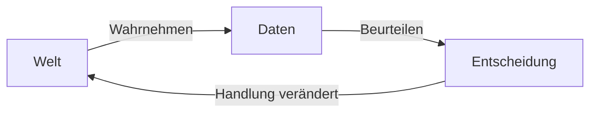
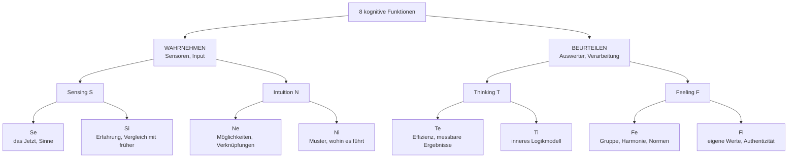
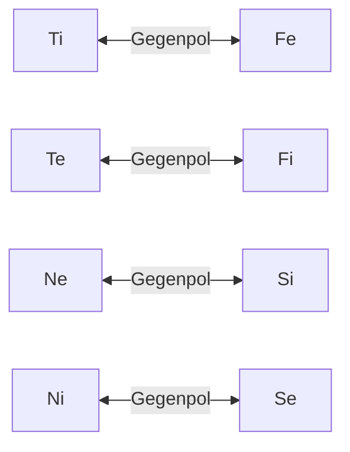
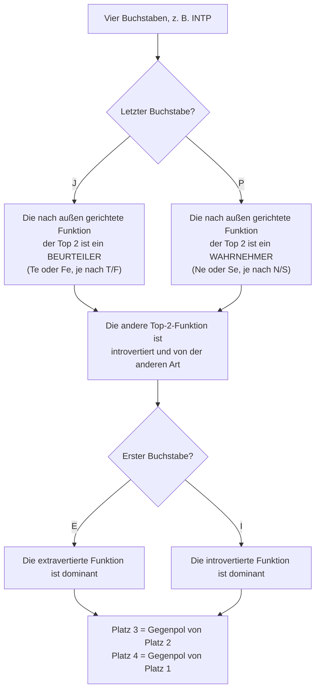
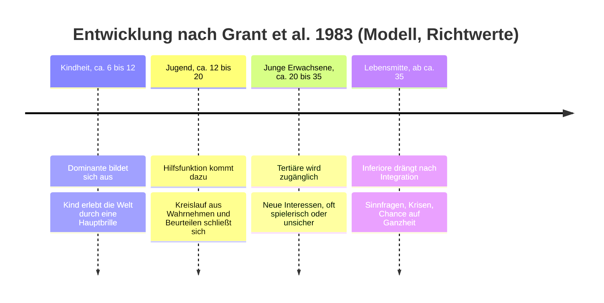
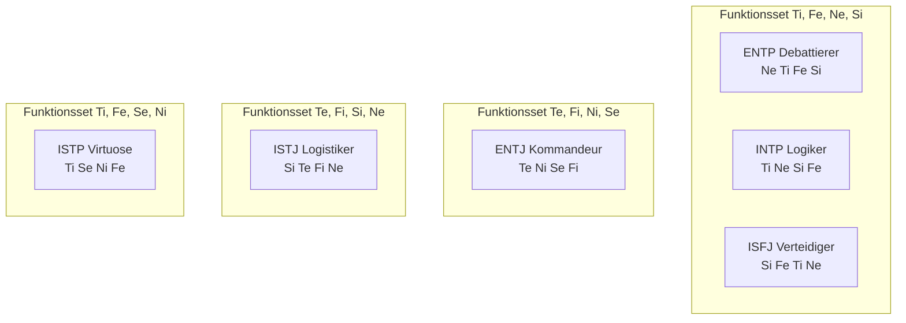

# Kognitive Funktionen verstehen

*Was hinter den vier Buchstaben steckt, wie das Modell funktioniert und warum man es durchschauen kann, ohne blind daran glauben zu müssen.*

---

## 0. Bevor es losgeht: Was dieser Text ist (und was nicht)

Vielleicht kommt dir das bekannt vor: Du hast in deinem Umfeld schon vielen Menschen recht treffsicher einen MBTI-Typen zugeordnet. Doch bei der Frage, warum ein ENTP und ein INTP angeblich dieselben kognitiven Funktionen teilen, während INTP und ENTJ nicht eine einzige gemeinsam haben, gerätst du ins Stocken. Plötzlich verschwimmen Kürzel wie Ti, Te, Ni und Ne zu einem unleserlichen Buchstabensalat.

Dieser Text baut das Modell Schritt für Schritt von Grund auf auf. Das Ziel: Du sollst die Systematik am Ende **selbst herleiten** können, anstatt sie stur auswendig zu lernen.

Vorab eine ehrliche Einordnung, die für den gesamten Text gilt:

> Die kognitiven Funktionen sind ein **theoretisches Modell**, das auf C. G. Jung (1921) zurückgeht und später von Isabel Briggs Myers und anderen erweitert wurde. Nur ein Teil dieses Modells ist empirisch belegt, der größere Teil nicht. Ich markiere im Text deutlich, was eine **Modellannahme** ist und wo es belastbare **Forschung** gibt. Ein Modell kann nützlich sein, ohne in jedem Punkt die objektive Wahrheit abzubilden. Die entscheidende Frage lautet: Ist es *in sich schlüssig* und hilft es uns, Dynamiken zu erkennen, die wir sonst übersehen würden?

---

## 1. Die Grundidee: Jeder Kopf hat zwei Aufgaben

Stell dir vor, du stehst an einer Straße und willst sie überqueren.

1. Du **siehst** ein Auto, schätzt seine Geschwindigkeit und hörst ein zweites hinter der Kurve.
2. Du **entscheidest** dich zu warten.

Das sind zwei grundverschiedene Tätigkeiten. Die erste **nimmt Daten auf**, die zweite **verarbeitet sie zu einem Urteil**. Jung nannte das:

- **Wahrnehmen** (Perceiving): Was ist da? Welche Informationen kommen herein?
- **Beurteilen** (Judging): Was mache ich damit? Was ist richtig, wichtig oder logisch?

Wer das einmal verstanden hat, hat den häufigsten Stolperstein bereits überwunden: **Nicht alle Funktionen machen dasselbe.** Vier davon fungieren als Sensoren (Wahrnehmung), vier als Auswerter (Beurteilung). Wer also beispielsweise *Ne* und *Te* verwechselt, verwechselt einen Sensor mit einem Auswerter.

### Zwei Arten wahrzunehmen, zwei Arten zu beurteilen

Für jede der beiden Aufgaben gibt es nach Jung zwei Varianten:

| Aufgabe | Variante | Leitfrage |
| --- | --- | --- |
| Wahrnehmen | **Sensing (S)** | Was ist konkret und nachweisbar vorhanden? |
| Wahrnehmen | **Intuition (N)** | Was steckt dahinter und was könnte daraus entstehen? |
| Beurteilen | **Thinking (T)** | Ist es logisch, stimmig und zielführend? |
| Beurteilen | **Feeling (F)** | Ist es wertvoll und menschlich richtig? |

Wichtig: *Feeling* (Fühlen) bedeutet hier nicht „emotional“, sondern „urteilt nach Werten“. Eine F-Entscheidung kann völlig ruhig und rational begründet sein.

### Die Richtung: innen oder außen

Jede dieser vier Varianten kann **nach außen** (extravertiert, e) oder **nach innen** (introvertiert, i) gerichtet sein. Der kleine Buchstabe (*i* oder *e*) verrät also nicht, ob jemand gerne auf Partys geht, sondern **woher die Funktion ihr Material holt bzw. ihren Maßstab nimmt**.

2 Aufgaben × 2 Varianten × 2 Richtungen = **8 Funktionen**.

---

## 2. Die acht Funktionen im Alltag

### Die vier Wahrnehmer: Du kommst in eine fremde Stadt

| Funktion | Was sie bemerkt |
| --- | --- |
| **Se** | Der Geruch aus der Bäckerei, das Kopfsteinpflaster, die Straßenmusik. Sie ist ganz im Moment und reagiert unmittelbar. |
| **Si** | „Das erinnert mich an Lissabon. Damals war die Altstadt abends zu laut, ich nehme lieber ein Hotel am Rand.“ Sie vergleicht neue Eindrücke mit gespeicherter Erfahrung. |
| **Ne** | „Da drüben ist ein Flohmarkt. Wir könnten aber auch die Fähre nehmen oder einfach im Bus bis zur Endstation fahren.“ Sie sieht Abzweigungen und Möglichkeiten. |
| **Ni** | „Dieses Viertel kippt gerade. In fünf Jahren wird es hier teuer sein.“ Sie verdichtet Eindrücke zu einer klaren Richtung, oft ohne den genauen Weg dorthin benennen zu können. |

### Die vier Beurteiler: Die Gruppe sucht ein Restaurant

| Funktion | Wie sie entscheidet |
| --- | --- |
| **Te** | „Wir nehmen das nächste Lokal mit über 4,5 Sternen, das jetzt noch offen hat. Ich reserviere.“ Maßstab: externe, überprüfbare Kriterien. |
| **Ti** | „Moment, was sind eigentlich unsere Kriterien? Preis, Entfernung und Qualität widersprechen sich teilweise.“ Maßstab: innere logische Konsistenz. |
| **Fe** | „Anna isst kein Fleisch und Tom hatte heute einen harten Tag. Was passt für uns alle am besten?“ Maßstab: das Wohlbefinden der Gruppe. |
| **Fi** | „In dieses Lokal mit Massentierhaltung gehe ich nicht, egal wie gut es bewertet ist.“ Maßstab: die eigenen, inneren Werte. |

Jeder Mensch nutzt all diese Funktionen. Das Modell besagt lediglich: **Jeder hat eine feste Rangfolge**, in der er sie bevorzugt einsetzt und entsprechend gut beherrscht.

---

## 3. Ein Plan, acht Reaktionen

Wenden wir nun alle acht Funktionen auf ein konkretes Beispiel an. Jemand aus der Familie stellt einen Businessplan vor: **Ein abgelegenes Anwesen kaufen, um dort Schokolade herzustellen.**

Achte darauf, wie die Wahrnehmer etwas **bemerken**, während die Beurteiler etwas **bewerten**.

### Wahrnehmer: „Was sehe ich an diesem Plan?“

| Funktion | Typische innere Reaktion |
| --- | --- |
| **Se** | „Das Gebäude, der intensive Duft nach Kakao, Kunden, die am Stand probieren. Ich sehe das direkt vor mir und es fühlt sich lebendig an.“ |
| **Si** | „Wie lief es bei Bekannten, die ebenfalls gegründet haben? Was ist sicher und bewährt, und was gibt man dafür auf?“ |
| **Ne** | „Warum gleich kaufen? Man könnte erst eine Produktionsküche mieten, nur auf Festivals verkaufen oder einen Onlineshop testen.“ |
| **Ni** | „Abgelegen heißt: lange Lieferwege, Personalmangel und Abhängigkeit vom Festivalsommer. Ich sehe schon, wo das in drei Jahren endet.“ |

### Beurteiler: „Was halte ich davon?“

| Funktion | Typische innere Reaktion |
| --- | --- |
| **Te** | „Welcher monatliche Umsatz ist realistisch? Was kostet das Anwesen inklusive Sanierung? Wann ist der Break-even erreicht?“ |
| **Ti** | „Die Annahme, dass der Festivalumsatz linear auf das ganze Jahr hochgerechnet werden kann, ist unlogisch, da Festivals nur im Sommer stattfinden.“ |
| **Fe** | „Wie reagiert die Familie, wenn ich Bedenken äußere? Wie verpacke ich meine Kritik, ohne ihn zu entmutigen?“ |
| **Fi** | „Das ist sein absoluter Traum. Es passt zu ihm, es ist authentisch – und das ist am Ende das, was zählt.“ |

Keine dieser Reaktionen ist „falsch“. Jeder sieht einen echten Teil des Gesamtbildes. In Abschnitt 8 kehren wir zu genau diesem Plan zurück.

---

## 4. Vom Baukasten zum Stapel: Die Konstruktionsregeln

Bisher haben wir acht einzelne Bausteine. Ein MBTI-Typ ist im Grunde eine **geordnete Auswahl von vier** dieser Bausteine – der sogenannte **Funktionsstapel (Stack)**:

1. **Dominante Funktion**: Die Hauptfunktion; sie wird am häufigsten und selbstverständlichsten genutzt.
2. **Hilfsfunktion** (Auxiliar): Die Unterstützerin der Dominanten.
3. **Tertiäre Funktion**: Entwickelt sich später, wird oft verspielt oder unsicher eingesetzt.
4. **Inferiore Funktion**: Die schwächste und am wenigsten bewusste Funktion.

Die Reihenfolge dieser Funktionen ist nicht beliebig. Das Modell gibt strenge Regeln vor. Wichtig: Es handelt sich hierbei um **Konstruktionsregeln des Modells**, nicht um neurologische Naturgesetze. Ich ordne bei jeder Regel ein, woher sie stammt und warum sie innerhalb der Theorie Sinn ergibt.

### Regel 1: Unter den Top 2 sind ein Wahrnehmer und ein Beurteiler

*Herkunft: Jung selbst (Psychologische Typen, 1921). Er beschreibt die Hilfsfunktion in ihrem Wesen als verschieden von der Hauptfunktion: Ist die Hauptfunktion urteilend („rational“), ist die Hilfsfunktion wahrnehmend („irrational“) und umgekehrt.*

**Warum das Sinn ergibt:** Erinnere dich an den Kreislauf aus Abschnitt 1. Zwei Beurteiler an der Spitze (z. B. Ti und Fe) wären wie zwei Auswerter ohne Sensor – Urteile ohne frisches Material. Zwei Wahrnehmer (z. B. Ne und Si) entsprächen Sensoren ohne Auswertung: eine endlose Flut an Daten, aber keine Entscheidung. Die Regel stellt sicher, dass die beiden stärksten Funktionen einen funktionsfähigen Kreislauf bilden.

### Regel 2: Unter den Top 2 ist eine nach innen und eine nach außen gerichtet

*Herkunft: Wurde vor allem von Isabel Briggs Myers ausformuliert (Gifts Differing, 1980). Bei Jung ist dieser Punkt weniger eindeutig.*

**Warum das Sinn ergibt:** Zwei introvertierte Funktionen an der Spitze (z. B. Ti und Ni) hätten keinen bevorzugten Kanal zur Außenwelt. Zwei extravertierte (z. B. Ne und Te) hätten keinen geschützten Ort zur inneren Verarbeitung. Die Regel sorgt dafür, dass jeder Typ einen ausgebauten Zugang zu **beiden** Welten besitzt.

### Regel 3 und 4: Die unteren Plätze sind die Gegenpole

*Herkunft: Spätere Autoren, u. a. Grant, Thompson & Clarke (1983) und John Beebe. In diesem Bereich unterscheiden sich die theoretischen Schulen teilweise.*

Jede Funktion hat einen festen Gegenpol: gleiche Aufgabe, andere Variante, andere Richtung.

- **Tertiäre** = Gegenpol der Hilfsfunktion
- **Inferiore** = Gegenpol der Dominanten

**Warum das Sinn ergibt:** Die inferiore Funktion steht für genau jene Aspekte, die die Dominante systematisch ausblendet. Wer die Welt primär durch ein inneres Logikmodell (Ti) betrachtet, hat am wenigsten Aufmerksamkeit für die emotionale Gruppendynamik (Fe) übrig. Das Modell beschreibt Persönlichkeit somit als Kompromiss: Eine dominante Stärke bedingt immer einen blinden Fleck auf der gegenüberliegenden Seite.

### Ein Konsistenzcheck zum Selbstausrechnen

Wie viele Stacks lassen diese Regeln zu?

- **8** Möglichkeiten für die Dominante.
- Für die Hilfsfunktion bleiben nach Regel 1 und 2 genau **2** Optionen übrig (Beispiel: Ist Ti dominant, kommen als Hilfsfunktion nur Ne oder Se infrage).
- Tertiäre und inferiore Funktionen sind durch die Gegenpol-Regel zwingend festgelegt.

8 × 2 = **16 Stacks**.
Gleichzeitig gibt es genau 16 Buchstabenkombinationen aus I/E, S/N, T/F und J/P. Die Regeln erzeugen also exakt so viele Stacks, wie der Code abbilden kann, und jede Kombination entspricht genau einem Stack. Das beweist zwar nicht die Richtigkeit des Modells in der echten Welt, zeigt aber, dass es **in sich mathematisch geschlossen** ist.

### Den Stack aus den Buchstaben ableiten

Man muss die Stacks nicht auswendig lernen. Ein kurzer Algorithmus reicht völlig aus:

**Am Beispiel INTP durchgerechnet:**

1. **P**: Die extravertierte Funktion ist ein Wahrnehmer. Wegen des **N** ist es **Ne**.
2. Die zweite Top-Funktion muss demnach ein introvertierter Beurteiler sein. Wegen des **T** ist es **Ti**.
3. **I**: Da der Typ introvertiert ist, ist die introvertierte Funktion die dominante. Platz 1 und 2 sind also **Ti, Ne**.
4. Gegenpol von Ne = **Si**, Gegenpol von Ti = **Fe**.

Ergebnis: **Ti – Ne – Si – Fe**.

Die größte Tücke liegt im letzten Buchstaben (J/P): Bei Introvertierten beschreibt dieser nämlich die *Hilfsfunktion*, nicht die Dominante. Ein INTP ist im Kern also ein tiefgründiger Beurteiler (Ti), obwohl das nach außen sichtbare „P“ etwas anderes suggeriert. 

### Wie belastbar ist das alles empirisch?

Hier lohnt sich ein nüchterner Blick auf die Fakten:

- **Die vier Skalen** (E/I, S/N, T/F, J/P) sind gut untersucht. Sie korrelieren deutlich mit vier der Big-Five-Persönlichkeitsfaktoren: E/I mit Extraversion, S/N mit Offenheit, T/F mit Verträglichkeit, J/P mit Gewissenhaftigkeit (McCrae & Costa, 1989).
- **Zwillingsstudien** zeigen, dass diese Skalen einen deutlichen genetischen Anteil haben, ähnlich wie andere Persönlichkeitsmerkmale (Bouchard & Hur, 1998). Dies stützt jedoch nur die *Skalen*, nicht das Konzept der Funktionen oder Stacks.
- **Typen als starre Kategorien** sind wissenschaftlich schwach belegt. Testwerte sind in der Regel normalverteilt und nicht zweigipflig (bimodal) (Bess & Harvey, 2002). Wiederholt man den Test nach wenigen Wochen, landet ein erheblicher Teil der Getesteten bei einem anderen Typ (Pittenger, 1993, 2005). Jemand, der genau auf der Grenze zwischen T und F liegt, „ist“ schlicht nicht eindeutig eines von beiden.
- **Die Funktionsdynamik** (Stacks, Dominante, Inferiore und die oben genannten Konstruktionsregeln) ist empirisch so gut wie nicht gestützt. Eine Auswertung der verfügbaren Daten durch Reynierse (2009) fand keine überzeugende Bestätigung für dieses hierarchische System.

Kurz gesagt: Die Messung der Buchstaben-Skalen ist halbwegs solide, doch die Architektur der Funktionen ist und bleibt **Theorie**. Den Rest dieses Textes solltest du wie die Dokumentation eines IT-Systems lesen: Die Spezifikationen sind extrem logisch und konsistent aufgebaut, aber inwieweit das System die menschliche Psyche exakt abbildet, ist nicht bewiesen.

---

## 5. Wie sich der Stack im Laufe des Lebens entwickelt

Die bekannteste Theorie zur Entwicklung der Funktionen stammt von Grant, Thompson & Clarke (1983). Die angegebenen Altersspannen sind dabei nur grobe Richtwerte.

### Kindheit: Der Blick durch eine einzige Brille

Laut Modell wirken Kinder oft sehr einseitig, weil vor allem ihre Dominante arbeitet. Ein Ne-Kind springt rastlos von Idee zu Idee, ein Si-Kind beharrt hartnäckig auf dem gewohnten Abendritual, und ein Ti-Kind treibt seine Eltern mit unzähligen „Aber warum?“-Fragen in den Wahnsinn.

### Jugend: Die Hilfsfunktion schließt den Kreislauf

In der Jugendzeit entwickelt sich die Hilfsfunktion. Sie liefert der Dominanten genau das, was ihr bisher gefehlt hat:

- **Die fehlende Aufgabe:** Ist die Dominante ein Beurteiler, liefert die Hilfsfunktion neues Datenmaterial. Ist die Dominante ein Wahrnehmer, bringt die Hilfsfunktion die Fähigkeit zur Selektion und Entscheidung.
- **Die fehlende Richtung:** Introvertierte erhalten einen verlässlichen Kanal in die Außenwelt, Extravertierte einen geschützten Raum zum inneren Nachdenken.

Zwei Beispiele:
- **Ein ENTP-Jugendlicher** (Ne dominant) hatte als Kind hunderte Ideen, ohne je eine zu Ende zu bringen. Durch Ti bekommt er nun Prüfkriterien: Er fängt an, Ideen zu verwerfen und Argumente aufzubauen. Diskutieren wird zum Sport.
- **Ein INTP-Jugendlicher** (Ti dominant) brütete als Kind oft endlos über wenigen Themen. Mit Ne holt er sich nun Futter von außen: neue Theorien, Hobbys und interessante Gesprächspartner. Das innere Denksystem bekommt neues Material.

### Erwachsene: Tertiäre und Inferiore Funktion

Im Erwachsenenalter wird laut Theorie die tertiäre Funktion zugänglicher – oft über Hobbys oder neue soziale Rollen. Später im Leben drängt die inferiore Funktion ins Bewusstsein. Jung nannte diese Phase, in der wir vernachlässigte Seiten in uns integrieren, *Individuation*.

**Was die Forschung dazu sagt:** Dass Menschen mit dem Alter durchschnittlich ausgeglichener werden, ist empirisch gut belegt. Eine große Metaanalyse zeigt, dass Eigenschaften wie Gewissenhaftigkeit, Verträglichkeit und emotionale Stabilität vom jungen bis ins mittlere Erwachsenenalter stetig zunehmen (Roberts, Walton & Viechtbauer, 2006). Dass diese Reifung jedoch exakt in der **Reihenfolge des Funktionsstapels** verläuft, lässt sich nicht nachweisen. Das Modell bietet hier eine schöne Erzählung für einen realen Effekt, aber keinen echten Beweis für den Mechanismus.

### Stress: Wenn die inferiore Funktion das Steuer übernimmt

Naomi Quenk (2002) beschreibt den sogenannten „Grip“: Unter extremem Stress oder tiefer Erschöpfung übernimmt die inferiore Funktion die Kontrolle – allerdings in einer unreifen, oft übertriebenen Form. Man erkennt sich selbst kaum wieder.

| Dominante | Inferiore | So zeigt sich der "Grip" (Stresszustand) |
| --- | --- | --- |
| Ne (ENTP) | Si | Hypochondrie, Fixierung auf Körpersignale, kleinliches Festhalten an Details |
| Ti (INTP, ISTP) | Fe | Plötzliche emotionale Ausbrüche, das bittere Gefühl, von niemandem gemocht zu werden |
| Si (ISFJ, ISTJ) | Ne | Katastrophenszenarien: „Was ist, wenn absolut alles schiefgeht?“ |
| Te (ENTJ) | Fi | Völlige Überwältigung durch Gefühle, tiefe Selbstzweifel und das Gefühl von Wertlosigkeit |
| Se (ESFP) | Ni | Düstere Vorahnungen, obsessives Deuten von Zeichen, Tunnelblick auf eine negative Zukunft |
| Ni (INTJ) | Se | Exzessives Sinnesverhalten: Binge-Eating, Kaufrausch, stundenlanges Serienschauen |

---

## 6. Sechs Typen im direkten Vergleich

Die folgenden Spitznamen stammen von der Plattform *16Personalities*. (Kleine Randnotiz: 16Personalities nutzt paradoxerweise gar keine kognitiven Funktionen, sondern ein Big-Five-basiertes Skalenmodell).

| Typ | Spitzname | Dominant | Hilfs | Tertiär | Inferior |
| --- | --- | --- | --- | --- | --- |
| **ENTP** | Debattierer | Ne | Ti | Fe | Si |
| **INTP** | Logiker | Ti | Ne | Si | Fe |
| **ISFJ** | Verteidiger | Si | Fe | Ti | Ne |
| **ISTJ** | Logistiker | Si | Te | Fi | Ne |
| **ENTJ** | Kommandeur | Te | Ni | Se | Fi |
| **ISTP** | Virtuose | Ti | Se | Ni | Fe |

Bevor wir uns die Typen genauer ansehen, hier eine faszinierende Beobachtung, die die vier Buchstaben komplett verschleiern:

- **ENTP, INTP und ISFJ nutzen exakt dieselben vier Funktionen**, nur in anderer Gewichtung. Der ISFJ ist sogar das genaue Spiegelbild des ENTP: Was beim einen ganz oben steht, liegt beim anderen ganz unten.
- **INTP und ENTJ teilen keine einzige Funktion**, obwohl sie beide die Buchstaben „NT“ im Code haben. Der INTP denkt mit Ti und nimmt wahr mit Ne. Der ENTJ denkt mit Te und nimmt wahr mit Ni. Die oberflächliche Ähnlichkeit der Buchstaben ist hier extrem irreführend.

### ENTP, der Debattierer: Ne – Ti – Fe – Si
- **Kindheit (Ne):** Ein sprudelnder Quell an Ideen. „Was wäre, wenn …?“ Spielzeug wird zweckentfremdet, Regeln werden kritisch hinterfragt.
- **Jugend (+Ti):** Die Ideen bekommen Prüfkriterien. Der Jugendliche argumentiert leidenschaftlich und wechselt im Gespräch auch mal die Seite, nur um die Haltbarkeit der Gegenposition zu testen.
- **Erwachsen (+Fe):** Lernt, Stimmungen zu lesen, Menschen mitzunehmen und zu moderieren.
- **Auswirkung:** Brillanter Starter, schwacher Finisher. Das inferiore Si (Routine, Detailarbeit, Körperpflege) bleibt eine ewige Baustelle.

### INTP, der Logiker: Ti – Ne – Si – Fe
- **Kindheit (Ti):** Will bis ins Detail verstehen, wie die Welt funktioniert. Baut sich innere Ordnungssysteme, die für andere meist unsichtbar bleiben.
- **Jugend (+Ne):** Die Neugier richtet sich nach außen: viele Interessen, Gedankenexperimente. Ne liefert, Ti sortiert.
- **Erwachsen (+Si):** Wissen wird tiefer verankert, Routinen verlässlicher. Bewährte Methoden gewinnen an Wert.
- **Auswirkung:** Nach außen ruhig, innen ein unaufhörlicher Analyseprozess. Ein INTP schweigt lieber, als etwas Ungenaues zu sagen. Das inferiore Fe macht soziale Konventionen anstrengend – Small Talk wirkt wie ein lästiges Protokoll ohne klare Spezifikation.

> **ENTP vs. INTP:** Gleiche Funktionen, aber vertauschte Prioritäten. Der ENTP *sammelt* erst Möglichkeiten und prüft sie dann. Der INTP *baut* erst ein logisches Modell und holt sich dann Möglichkeiten, um es zu testen. Im Gespräch merkt man das sofort: Der ENTP denkt laut und verwirft Ideen noch während des Redens. Der INTP denkt erst fertig und spricht dann.

### ISFJ, der Verteidiger: Si – Fe – Ti – Ne
- **Kindheit (Si):** Liebt das Vertraute, merkt sich Geburtstage, Vorlieben und wie Dinge „immer schon“ gemacht wurden.
- **Jugend (+Fe):** Übernimmt Fürsorge, vermittelt in Konflikten und spürt treffsicher die Stimmung im Raum.
- **Erwachsen (+Ti):** Lernt, eigene Argumente zu formulieren und Grenzen zu setzen, anstatt sich nur für andere aufzuopfern.
- **Auswirkung:** Verlässlich, warmherzig und bewahrend. Das inferiore Ne äußert sich unter Stress als negatives Kopfkino: tausend Möglichkeiten, aber nur die schlimmsten.

### ISTJ, der Logistiker: Si – Te – Fi – Ne
- **Kindheit (Si):** Ordnung, klare Regeln und Bewährtes geben Halt.
- **Jugend (+Te):** Organisiert, plant und erledigt Aufgaben hocheffizient.
- **Erwachsen (+Fi):** Eigene Werte werden bewusster, wirken im Hintergrund als moralischer Kompass.
- **Auswirkung:** Pflichtbewusst und extrem belastbar. Plötzliche Planänderungen oder völlig offene Situationen (inferiores Ne) erzeugen starkes Unbehagen.

> **ISFJ vs. ISTJ:** Beide haben denselben Wahrnehmer (Si) als Basis. Doch während der ISFJ diese Erfahrung nutzt, um sich um **Menschen** zu kümmern (Fe), nutzt der ISTJ sie, um **Prozesse und Ergebnisse** zu optimieren (Te).

### ENTJ, der Kommandeur: Te – Ni – Se – Fi
- **Kindheit (Te):** Organisiert die Spiele, verteilt Rollen, will immer, dass es vorangeht.
- **Jugend (+Ni):** Entwickelt Weitblick. Aus „wir machen das jetzt“ wird strategisches Denken: „wir tun dies, damit in zwei Jahren jenes passiert.“
- **Erwachsen (+Se):** Mehr Präsenz im Hier und Jetzt, Spaß an Wettbewerb, Status und Erlebnissen.
- **Auswirkung:** Hochgradig zielorientiert und führungsstark. Die eigenen Gefühle (inferiores Fi) werden oft ignoriert und brechen bei Erschöpfung manchmal unkontrolliert durch.

### ISTP, der Virtuose: Ti – Se – Ni – Fe
- **Kindheit (Ti):** Schraubt, zerlegt, probiert aus. Will mit den Händen greifen, wie Mechaniken funktionieren.
- **Jugend (+Se):** Fokus auf körperliches Können, Werkzeuge und schnelle Reaktionen (Sport, Motorradfahren, Handwerk).
- **Erwachsen (+Ni):** Ein fast intuitives Gespür für Muster. Weiß oft schon, dass eine Maschine gleich ausfällt, bevor es messbar ist.
- **Auswirkung:** Kühler Pragmatismus. In Krisen extrem ruhig und handlungsfähig. Soziale Erwartungen (inferiores Fe) kosten jedoch viel Energie.

---

## 7. Warum manche schnell entscheiden und andere endlos abwägen

Mit dem Wissen über die Stacks lässt sich ein Phänomen erklären, das im Alltag oft für Reibung sorgt: Warum entscheidet sich Person A nach fünf Minuten, während Person B nach drei Wochen immer noch abwägt?

Laut Modell hängt das von drei Faktoren ab:

1. **Wo steht der primäre Beurteiler?** Steht er auf Platz 1, steht das Fällen von Urteilen im Vordergrund. Auf Platz 2 wird erst ausgiebig wahrgenommen, bevor das Urteil folgt.
2. **Ist der Beurteiler extra- oder introvertiert?** Te und Fe nutzen Kriterien aus der Außenwelt, die sich leicht kommunizieren lassen (Zahlen, Deadlines, die Bedürfnisse der Gruppe). Ti und Fi arbeiten mit einem inneren Maßstab, der zuerst *stimmig* sein muss – ein Prozess, den man von außen kaum abkürzen kann.
3. **Was liefert der Wahrnehmer?** Ni und Si *verengen* den Fokus (auf ein Muster oder einen bekannten Präzedenzfall). Ne und Se *öffnen* ihn (für neue Optionen oder neue Reize im Moment).

Der letzte Buchstabe im MBTI-Code verrät dir sofort, was nach außen sichtbar ist: **J** (Judging) bedeutet, dass du deine urteilende Funktion nach außen trägst. Andere sehen also, wie du dich festlegst. **P** (Perceiving) bedeutet, dass du deine wahrnehmende Funktion nach außen zeigst – du wirkst, als würdest du dir alle Optionen offenhalten. (Dies ist übrigens einer der empirisch solideren Punkte: Die J/P-Skala korreliert stark mit dem Big-Five-Faktor Gewissenhaftigkeit).

### Entscheidungsstile auf einen Blick

| Typ | Stil | Erklärung aus dem Modell |
| --- | --- | --- |
| **ENTJ** (Te–Ni) | Entschlossen und rasch | Te nutzt harte, äußere Fakten. Ni verengt die vielen Optionen auf den einen besten Weg. Beide Kräfte forcieren einen schnellen Abschluss. |
| **ISTJ** (Si–Te) | Zügig und konservativ | Si liefert den Präzedenzfall („So hat es früher geklappt“), Te wendet gnadenlos Checklisten an. |
| **ISFJ** (Si–Fe) | Schnell für andere, zäh für sich selbst | Fe weiß sofort, was die Gruppe braucht. Für die eigenen Wünsche fehlt jedoch das Kriterium, da der innere Maßstab (Ti) schwächer ist. |
| **ISTP** (Ti–Se) | Blitzschnell im Handeln, träge bei Theorie | Se liefert harte Fakten in Echtzeit, Ti bewertet sie sofort. Bei reiner Theorie oder abstrakten Langfristplänen fehlt dieser konkrete Input. |
| **INTP** (Ti–Ne) | Sehr gründlich, oft verzögert | Zwar steht der Beurteiler (Ti) ganz oben, doch er verlangt ein fehlerfreies Modell. Ne liefert derweil ständig neue Ausnahmen, die eine Entscheidung wieder torpedieren. |
| **ENTP** (Ne–Ti) | Zögerlich bis sprunghaft | Siehe Detailanalyse unten. |

### Warum es ENTPs besonders schwer haben

Beim ENTP drängen alle drei Faktoren in Richtung „offen lassen“, und die inferiore Funktion bietet keinerlei Halt:

1. **Der Wahrnehmer steht oben und erzeugt permanent neue Optionen (Ne).** Sich zu entscheiden bedeutet, dass neun von zehn spannenden Wegen sterben. Das fühlt sich für Ne wie ein echter Verlust an.
2. **Das Urteil (Ti) liegt innen und greift erst an zweiter Stelle.** Es gibt kein äußeres Regelwerk, auf das man sich einfach berufen könnte. Das innere Argument muss stimmen, doch Ne bringt laufend neue Variablen ins Spiel.
3. **Fe auf Platz 3** fügt eine soziale Ebene hinzu: Wie kommt das bei den anderen an? Das bedeutet noch mehr Variablen.
4. **Si (Erfahrung) fehlt als Anker.** Si würde sagen: „Wir haben das letztes Mal so gemacht, mach es wieder so.“ Da Si beim ENTP am schwächsten ist, muss jede noch so triviale Entscheidung quasi philosophisch neu begründet werden.

Wichtig: ENTPs entscheiden extrem schnell, wenn die Optionen **klar, umkehrbar oder durch äußeren Druck limitiert** sind (z. B. durch eine harte Deadline). Zur Qual werden nur offene Entscheidungen ohne Frist und mit unzähligen Möglichkeiten.

### Praktische Hebel (nicht nur für ENTPs)

Wer sich schwer tut, Entscheidungen zu treffen, kann Schwächen im eigenen Stack gezielt durch äußere Rahmenbedingungen ausgleichen:

| Hebel | Was er im Modell kompensiert |
| --- | --- |
| Eine externe Deadline setzen | Ersetzt das fehlende äußere Kriterium (Te/Fe-Ersatz). |
| Maximal drei Optionen zulassen | Bremst die endlose Ne-Maschine aus. |
| Es als „Experiment“ framen | Beruhigt Ne: Nichts ist endgültig, man testet es nur für vier Wochen. |
| „Gut genug“ definieren | Gibt Ti ein klares Abbruchkriterium, statt endlos nach der Ideallösung zu suchen. |
| Mit einem Te-Menschen reden | Holt sich den pragmatischen Fokus auf machbare Ziele von außen. |

---

## 8. Fallstudie: Eine Familie und ein Schokoladen-Businessplan

Zum Abschluss wenden wir das Modell auf reale Menschen an. Die Typen sind Selbst- bzw. Fremdeinschätzungen (beim Cousin eine fundierte Vermutung).

| Person | Typ | Spitzname | Stack |
| --- | --- | --- | --- |
| Ich | ENTP | Debattierer | Ne – Ti – Fe – Si |
| Mutter | ISFJ | Verteidiger | Si – Fe – Ti – Ne |
| Vater | INTJ | Architekt | Ni – Te – Fi – Se |
| Cousin | ESFP | Entertainer | Se – Fi – Te – Ni |

**Die Ausgangslage:** Der Cousin (ESFP) verkauft sehr erfolgreich Waren auf Festivals, hat viel Kundenkontakt und erste Mitarbeiter. Nun präsentiert er seinen Businessplan: Er will ein abgelegenes Anwesen kaufen, um dort ganzjährig Schokolade zu produzieren.
Mein Vater und ich sind höchst skeptisch. Die Zahlen wirken geschönt, mögliche Risiken (Personalmangel auf dem Land) werden ausgeblendet, und die Gefahr, dass seine aktuelle Erwerbsminderungsrente wegfallen könnte, wird im Plan nicht einmal erwähnt.

### Was das Modell über den Plan sagt

Liest man den Stack des ESFP von oben nach unten, erklärt sich der Plan von selbst:

- **Se (dominant)** erklärt seinen bisherigen Erfolg. Die Präsenz vor Ort, das Gespür für den Moment und die Kunden – das ist keine Schwäche des Plans, das ist sein Fundament.
- **Fi (Hilfsfunktion)** trifft die emotionale Kernentscheidung: Die eigene Manufaktur fühlt sich richtig und authentisch an. Es ist sein Lebenstraum. Kritik am Plan fühlt sich für ihn unweigerlich wie Kritik an seiner Person an.
- **Te (tertiär)** ist vorhanden, dient aber hier nicht der kalten *Prüfung* der Idee. Tertiäre Funktionen arbeiten oft als Handlanger der oberen beiden: Die Zahlen werden bemüht, um die (bereits durch Fi getroffene) Entscheidung zu *rechtfertigen*. Das erklärt, warum der Plan „geschönt“ wirkt.
- **Ni (inferior)** ist der blinde Fleck. Ni würde fragen: „Wo stehen wir in fünf Jahren? Was übersehe ich?“ Saisonabhängigkeit, lange Lieferwege, Rentenverlust – das sind typische strategische Ni-Fragen, für die er aktuell keine Antenne hat.

### Warum Vater und ich so heftig reagieren

Vergleicht man die Stacks von Cousin und Vater, wird der Konflikt mathematisch sichtbar:

| Platz | Cousin (ESFP) | Vater (INTJ) |
| --- | --- | --- |
| 1 | **Se** | **Ni** |
| 2 | **Fi** | **Te** |
| 3 | Te | Fi |
| 4 | Ni | Se |

Der Vater (INTJ) ist das **exakte psychologische Gegenteil** des Cousins. Was dem Cousin fehlt (Ni, Te), sind die absoluten Kernkompetenzen des Vaters. Der Vater fordert sofort belastbare Zahlen (Te) und Langzeitprognosen (Ni). Gleichzeitig unterschätzt der Vater völlig, was der Cousin am besten kann: den direkten Kundenkontakt im Hier und Jetzt (Se).

Ich als ENTP komme über einen anderen Pfad zum selben skeptischen Ergebnis:
- **Ne** ruft: „Warum gleich kaufen? Lass uns erst mieten, einen Onlineshop hochziehen oder eine Wintersaison testen!“
- **Ti** findet die logischen Lücken: „Die Hochrechnung von Sommer-Festivals auf den Winterumsatz ist mathematisch nicht konsistent.“

Und meine Mutter? Als ISFJ legt sie den Fokus auf Sicherheit und Bewährtes (**Si**) – und die sichere Rente ist genau das. Gleichzeitig will sie die Harmonie in der Familie wahren (**Fe**). Sie ist wahrscheinlich die Einzige im Raum, die weiß, *wie* man die Bedenken äußern kann, ohne dass der Cousin beleidigt den Raum verlässt.

### Was man daraus praktisch lernen kann

Das Modell liefert keine Lösung für den Businessplan, aber einen hervorragenden Leitfaden für die Kommunikation. Die Kritik muss in der **Sprache der oberen Funktionen des Cousins (Se und Fi)** verpackt werden:

- **Fi respektieren:** Niemals den Traum angreifen, sondern nur den Weg dorthin. („Ich will unbedingt, dass das klappt“ statt „Das wird niemals funktionieren“).
- **Se ansprechen:** Abstrakte Ni-Risiken greifbar machen. „Lass uns mal den nächsten Februar durchspielen. Kein Festival, wir müssen heizen, zwei Gehälter zahlen. Was passiert da genau auf dem Konto?“
- **Ne als Kompromiss nutzen:** Kleine Testballons vorschlagen, die den Traum am Leben erhalten, aber das Risiko senken (erst mieten, dann kaufen).
- **Te auslagern:** Die rechtliche Frage nach der Rente einer objektiven Gründungsberatung übergeben. Ein neutraler Experte wird von Fi viel leichter akzeptiert als der kritische Onkel.

**Gegenprobe zur Realität:** Zu optimistische Businesspläne sind kein exklusives MBTI-Phänomen. Eine Studie zeigte, dass Gründer ihre eigenen Erfolgschancen fast immer drastisch überschätzen (Cooper, Woo & Dunkelberg, 1988). Auch der Hang, Zeit und Kosten chronisch zu unterschätzen (*Planning Fallacy*), ist in der Psychologie ein gut dokumentierter Standard (Buehler, Griffin & Ross, 1994). 
Das Typen-Modell erklärt hier also nicht primär, *dass* jemand zu optimistisch ist. Es erklärt jedoch hervorragend, *wo genau* die blinden Flecke liegen und wie man ein konstruktives Gespräch darüber führt.

---

## 9. Das Wichtigste in acht Sätzen

1. Es gibt **vier Wahrnehmer** (Se, Si, Ne, Ni), die Informationen sammeln, und **vier Beurteiler** (Te, Ti, Fe, Fi), die diese auswerten.
2. Ob eine Funktion introvertiert (i) oder extravertiert (e) ist, zeigt lediglich, **wo** sie ihren Maßstab oder ihr Datenmaterial sucht.
3. Die Top 2 eines Funktionsstapels bestehen immer aus **einem Wahrnehmer und einem Beurteiler** – einer davon nach innen, der andere nach außen gerichtet.
4. Durch diese mathematisch logischen Konstruktionsregeln ergeben sich exakt **16 Stacks** (Typen). 
5. Bei Introvertierten verrät der letzte Buchstabe (J/P) nicht die Dominante, sondern die **Hilfsfunktion**. (Ein INTP ist im Kern ein „Judging“-Typ).
6. Laut Theorie entwickeln sich die Funktionen in einer festen Reihenfolge (Dominante, Hilfs, Tertiäre, Inferiore). Dass wir reifer werden, ist messbar; dass es exakt so abläuft, ist empirisch nicht belegt.
7. Wie schnell jemand Entscheidungen trifft, hängt von der **Kombination** seiner Top-Funktionen ab (Fokus auf Außen/Innen, verengender oder öffnender Wahrnehmer).
8. Nutze das MBTI-Modell nicht als absolute wissenschaftliche Diagnose, sondern als **kommunikative Landkarte**: Es hilft extrem gut dabei zu verstehen, wer welche Aspekte sieht und wer was übersieht.

---

## Quellen und Weiterlesen

**Theorie**
- Jung, C. G. (1921). *Psychologische Typen*. Rascher.
- Myers, I. B. & Myers, P. B. (1980). *Gifts Differing: Understanding Personality Type*. Davies-Black.
- Grant, W. H., Thompson, M. & Clarke, T. E. (1983). *From Image to Likeness: A Jungian Path in the Gospel Journey*. Paulist Press.
- Beebe, J. (2016). *Energies and Patterns in Psychological Type*. Routledge.
- Quenk, N. L. (2002). *Was That Really Me? How Everyday Stress Brings Out Our Hidden Personality*. Davies-Black.

**Empirie & Forschung**
- McCrae, R. R. & Costa, P. T. (1989). Reinterpreting the Myers-Briggs Type Indicator from the perspective of the five-factor model of personality. *Journal of Personality, 57*(1), 17–40.
- Bouchard, T. J. & Hur, Y.-M. (1998). Genetic and environmental influences on the continuous scales of the Myers-Briggs Type Indicator: An analysis based on twins reared apart. *Journal of Personality, 66*(2), 135–149.
- Bess, T. L. & Harvey, R. J. (2002). Bimodal score distributions and the Myers-Briggs Type Indicator: Fact or artifact? *Journal of Personality Assessment, 78*(1), 176–186.
- Pittenger, D. J. (1993). Measuring the MBTI … and coming up short. *Journal of Career Planning and Employment, 54*(1), 48–52.
- Pittenger, D. J. (2005). Cautionary comments regarding the Myers-Briggs Type Indicator. *Consulting Psychology Journal, 57*(3), 210–221.
- Reynierse, J. H. (2009). The case against type dynamics. *Journal of Psychological Type, 69*(1), 1–21.
- Roberts, B. W., Walton, K. E. & Viechtbauer, W. (2006). Patterns of mean-level change in personality traits across the life course: A meta-analysis of longitudinal studies. *Psychological Bulletin, 132*(1), 1–25.
- Cooper, A. C., Woo, C. Y. & Dunkelberg, W. C. (1988). Entrepreneurs' perceived chances for success. *Journal of Business Venturing, 3*(2), 97–108.
- Buehler, R., Griffin, D. & Ross, M. (1994). Exploring the "planning fallacy": Why people underestimate their task completion times. *Journal of Personality and Social Psychology, 67*(3), 366–381.
