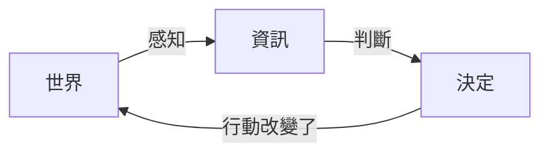
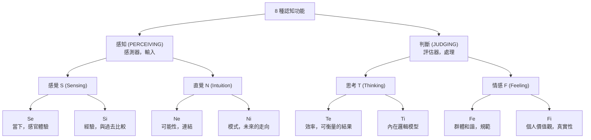
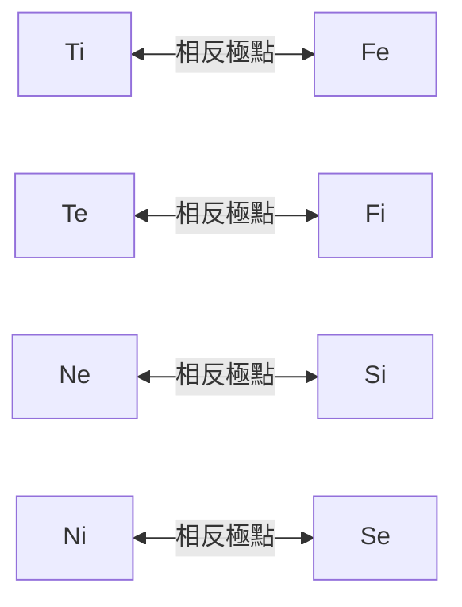
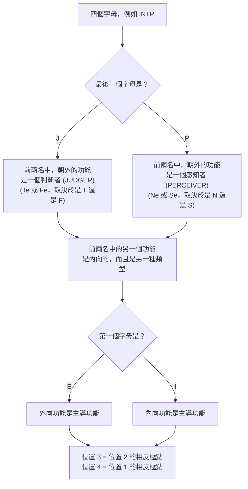
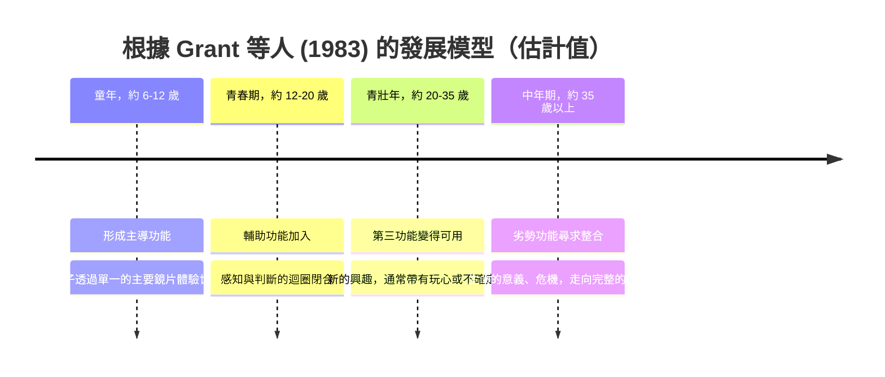
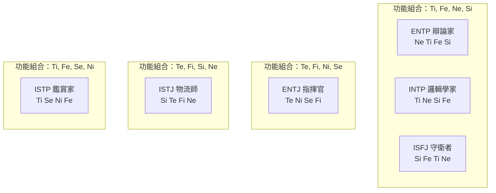

# 深入理解認知功能

*探討這四個字母背後的意義、模型的運作方式，以及為什麼你可以理解它而不必盲目相信它。*

---

## 0. 開始之前：這篇文章是什麼（以及不是什麼）

或許你對這個情境並不陌生：你已經成功猜出周遭許多人的 MBTI 類型。但是，當有人問你*為什麼* ENTP 和 INTP 據說擁有完全相同的認知功能，而 INTP 和 ENTJ 卻完全沒有共同點時，你卻腦袋一片空白。突然之間，Ti、Te、Ni 和 Ne 這些縮寫變成了一團令人費解的字母湯。

這篇文章將帶你從零開始，一步步建構這個模型。目標是：在閱讀完畢後，你應該能夠**自己推導出這個系統**，而不是死記硬背。

在開始之前，先做一個適用於全文的誠實聲明：

> 認知功能是一個**理論模型**，可追溯至榮格（C. G. Jung, 1921），後來由伊莎貝爾·布里格斯·邁爾斯（Isabel Briggs Myers）等人擴充。這個模型只有一部分獲得了實證支持，大部分則沒有。我會在文中清楚標示哪些是**模型假設**，哪些有堅實的**科學研究**支持。一個模型即使無法在每個細節上反映客觀真理，依然可以很實用。關鍵問題在於：它是否在*內部邏輯上一致*？它是否能幫助我們看見那些我們否則可能會忽略的動態關係？

---

## 1. 基本概念：每個大腦都有兩項任務

想像你正站在馬路邊，準備過馬路。

1. 你**看見**一輛車，估算它的速度，並聽見彎道後方有另一輛車駛來。
2. 你**決定**等待。

這是兩項截然不同的活動。第一項是**接收資訊**，第二項則是**將資訊處理成判斷**。榮格將此稱為：

- **感知 (Perceiving)**：那裡有什麼？有哪些資訊進來了？
- **判斷 (Judging)**：我要拿這些資訊怎麼辦？什麼是正確的、重要的或符合邏輯的？

一旦你理解了這一點，你就已經克服了最常見的絆腳石：**並非所有功能都在做同樣的事。** 其中四個像是感測器（感知），另外四個像是評估器（判斷）。因此，任何把 *Ne* 和 *Te* 搞混的人，其實是把感測器和評估器搞混了。

### 1.1. 兩種感知方式，兩種判斷方式

根據榮格的理論，這兩項任務各自有兩種變化形式：

| 任務 | 變化形式 | 核心提問 |
| --- | --- | --- |
| 感知 | **感覺 (Sensing, S)** | 什麼是具體且可以觀察到的？ |
| 感知 | **直覺 (Intuition, N)** | 背後隱藏著什麼？它可能發展成什麼？ |
| 判斷 | **思考 (Thinking, T)** | 它符合邏輯、一致且有效率嗎？ |
| 判斷 | **情感 (Feeling, F)** | 它有價值嗎？在人情上正確嗎？ |

重要提示：這裡的*情感 (Feeling)* 指的不是「情緒化」，而是「基於價值觀來做判斷」。一個 F（情感）的決定完全可以是冷靜且理性的。

### 1.2. 方向：向內或向外

這四種變化形式都可以指向**外部**（外向，e）或指向**內部**（內向，i）。小寫字母（*i* 或 *e*）並不是告訴我們這個人喜不喜歡參加派對；它告訴我們的是：**這個功能是從哪裡獲取素材或標準的。**

2 種任務 × 2 種變化形式 × 2 種方向 = **8 種認知功能**。

---

## 2. 日常生活中的八種功能

### 2.1. 四種感知者：來到陌生的城市

| 功能 | 它注意到什麼 |
| --- | --- |
| **Se** | 麵包店的香味、鵝卵石街道、街頭音樂。它完全活在當下，並立即做出反應。 |
| **Si** | 「這讓我想起里斯本。那時候舊城區晚上太吵了；我寧願住郊區的飯店。」它會將新印象與儲存的經驗進行比較。 |
| **Ne** | 「那邊有個跳蚤市場。不過我們也可以搭渡輪，或者乾脆坐公車到終點站看看。」它看到的是各種岔路與可能性。 |
| **Ni** | 「這個街區正在轉型。五年後這裡會變得非常昂貴。」它將各種印象濃縮成一個明確的方向，通常無法說出到達那裡確切的推導過程。 |

### 2.2. 四種判斷者：一群人找餐廳

| 功能 | 它如何做決定 |
| --- | --- |
| **Te** | 「我們去最近那家評分超過 4.5 顆星且還在營業的餐廳。我來訂位。」標準：外部的、可驗證的條件。 |
| **Ti** | 「等等，我們的標準到底是什麼？價格、距離和品質這三點有些互相矛盾。」標準：內在邏輯的一致性。 |
| **Fe** | 「Anna 不吃肉，而且 Tom 今天過得很糟。哪家餐廳最適合我們所有人？」標準：群體的福祉與和諧。 |
| **Fi** | 「我絕對不去那家使用工廠化養殖食材的餐廳，不管它的評價有多高。」標準：自己的內在價值觀。 |

每個人都會使用所有這些功能。這個模型只是說明：**每個人都有一套固定的優先順序**，他們會偏好使用某些功能，並因此對這些功能掌握得更好。

---

## 3. 一個計畫，八種反應

讓我們將這八種功能應用在一個具體的例子上。一位家庭成員提出了一項創業計畫：**買下一座偏遠的莊園，在裡面製造巧克力。**

請注意感知者如何**注意到**某些事，而判斷者如何**評估**某些事。

### 3.1. 感知者：「我從這個計畫中看到了什麼？」

| 功能 | 典型的內在反應 |
| --- | --- |
| **Se** | 「那棟建築、濃郁的可可香氣、在攤位試吃的顧客。那個畫面就浮現在我眼前，感覺充滿生機。」 |
| **Si** | 「那些也曾創業的熟人後來怎麼了？什麼是安全且被證明可行的？我們為了這個要放棄什麼？」 |
| **Ne** | 「為什麼要馬上買下來？你可以先租一間商用廚房，只在音樂祭賣，或者先測試一下網路商店。」 |
| **Ni** | 「偏遠意味著：物流路線長、缺工，而且依賴夏季音樂祭。我已經看到這件事三年後的結局了。」 |

### 3.2. 判斷者：「我對這個計畫有什麼看法？」

| 功能 | 典型的內在反應 |
| --- | --- |
| **Te** | 「每個月合理的營收是多少？包含翻修，這座莊園要花多少錢？什麼時候能損益兩平？」 |
| **Ti** | 「『音樂祭的營收可以線性推算到整年』這個假設是不合邏輯的，因為音樂祭只在夏天舉辦。」 |
| **Fe** | 「如果我提出擔憂，家人會有什麼反應？我該怎麼包裝我的批評才不會打擊他？」 |
| **Fi** | 「這是他絕對的夢想。這很適合他，很真實——而到頭來，這才是最重要的。」 |

這些反應沒有一個是「錯」的。每一種都看到了全貌中真實的一部分。我們在第 8 節會回到這個計畫。

---

## 4. 從積木到堆疊：建構規則

到目前為止，我們有了八塊獨立的積木。一個 MBTI 類型本質上就是這八塊積木中**排序好的四塊**——這被稱為**功能堆疊 (Function Stack)**：

1. **主導功能 (Dominant Function)**：主要功能；最常被使用、也最自然。
2. **輔助功能 (Auxiliary Function)**：主導功能的支援者。
3. **第三功能 (Tertiary Function)**：較晚發展，常被以玩樂或不確定的方式使用。
4. **劣勢功能 (Inferior Function)**：最弱、最無意識的功能。

這些功能的排序並非隨機，模型制定了嚴格的規則。重要提示：這是**模型的建構規則**，而不是神經科學的自然法則。我會解釋每條規則的由來，以及為什麼它在理論中是有意義的。

### 4.1. 規則一：前兩名包含一個感知者和一個判斷者

*來源：榮格本人（《心理類型》，1921年）。他描述輔助功能的本質應與主要功能不同：如果主要功能是判斷（「理性」），輔助功能就是感知（「非理性」），反之亦然。*

**為什麼這有意義：** 記得第 1 節的迴圈。如果頂部有兩個判斷者（例如 Ti 和 Fe），就像是兩個沒有感測器的評估器——只有判斷，卻沒有新鮮的素材。如果有兩個感知者（例如 Ne 和 Si），就像是沒有評估的感測器：有永無止盡的資訊洪流，卻做不出決定。這條規則確保了兩個最強的功能可以形成一個完整且有效的迴圈。

### 4.2. 規則二：前兩名包含一個向內和一個向外的功能

*來源：主要由伊莎貝爾·布里格斯·邁爾斯制定（《天賦異稟》，1980年）。這一點在榮格的原始著作中較不明確。*

**為什麼這有意義：** 如果頂部有兩個內向功能（例如 Ti 和 Ni），這個人將沒有與外部世界連結的偏好管道。如果兩個都是外向功能（例如 Ne 和 Te），則會缺乏進行內部處理的安全空間。這條規則確保每種類型都有發展出通往**兩個**世界的途徑。

### 4.3. 規則三和四：底部位置是完全相反的極點

*來源：後來的作者，包含 Grant, Thompson & Clarke (1983) 以及 John Beebe。理論學派在此領域有些微差異。*

每個功能都有一個固定的對立面：相同的任務、不同的變化形式、不同的方向。

- **第三功能** = 輔助功能的相反極點
- **劣勢功能** = 主導功能的相反極點

**為什麼這有意義：** 劣勢功能代表的，正是主導功能系統性忽略的面向。一個主要透過內在邏輯模型 (Ti) 看世界的人，對於情感性的團體動態 (Fe) 留下的注意力是最少的。因此，該模型將人格描述為一種妥協：一個主導優勢必定會在相反的一側產生盲點。

### 4.4. 你可以自己做的一致性檢查

這些規則允許存在多少種堆疊？

- 主導功能有 **8** 種可能性。
- 根據規則一和二，輔助功能只會剩下 **2** 種選擇（例如：如果 Ti 是主導，輔助功能只能是 Ne 或 Se）。
- 第三和劣勢功能則由「相反極點」規則嚴格決定。

8 × 2 = **16 種堆疊**。
同時，I/E、S/N、T/F 和 J/P 也剛好能組成 16 種字母組合。因此，規則產生的堆疊數量與代碼能表示的數量完全吻合，且每個組合剛好對應一種堆疊。雖然這不能證明該模型在現實世界中的準確性，但它顯示了該模型在**數學上是自洽（內部一致）的**。

### 4.5. 從字母推導出功能堆疊

你不需要死記硬背這些堆疊。只要一個簡短的演算法就夠了：

**以 INTP 為例進行推導：**

1. **P**：外向功能是感知者。因為有 **N**，所以是 **Ne**。
2. 因此，前兩名的另一個功能必須是內向判斷者。因為有 **T**，所以是 **Ti**。
3. **I**：因為這個類型是內向的，所以內向功能是主導功能。因此位置 1 和 2 是 **Ti, Ne**。
4. Ne 的相反 = **Si**，Ti 的相反 = **Fe**。

結果：**Ti – Ne – Si – Fe**。

最大的陷阱在於最後一個字母（J/P）：對內向者而言，它描述的是*輔助功能*，而不是主導功能。就核心而言，INTP 是一個極具深度的判斷者（Ti），儘管外在可見的「P」暗示了另一種形象。

### 4.6. 這些理論在實證上有多可靠？

在這裡，冷靜地看待事實是值得的：

- **這四個維度** (E/I, S/N, T/F, J/P) 的研究很充分。它們與五大性格特質 (Big Five) 中的四個有顯著相關：E/I 與外向性、S/N 與開放性、T/F 與宜人性、J/P 與嚴謹性 (McCrae & Costa, 1989)。
- **雙胞胎研究** 顯示，這些維度有明顯的遺傳成分，與其他性格特質相似 (Bouchard & Hur, 1998)。然而，這只支持了*維度量表*，而不支持功能或堆疊的概念。
- **將類型視為死板的分類** 在科學上的支持很薄弱。測試分數通常呈常態分佈，而非雙峰分佈 (Bess & Harvey, 2002)。如果在幾週後重新測試，很大一部分受試者會得到不同的類型 (Pittenger, 1993, 2005)。一個正好落在 T 和 F 邊界上的人，本來就不會「明確地」只屬於其中一邊。
- **功能動態**（堆疊、主導、劣勢及上述的建構規則）幾乎沒有實證支持。Reynierse (2009) 對現有數據的分析並未發現能令人信服地支持這種層級系統的證據。

簡而言之：字母維度的測量還算可靠，但功能的架構仍然是一種**理論**。請把這篇文章的其餘部分當作 IT 系統的技術文件來讀：規格的建立極具邏輯且一致，但這個系統能在多大程度上精確映射人類心理，仍未被證實。

---

## 5. 功能堆疊如何隨人生的發展而變化

關於功能發展最著名的理論來自 Grant, Thompson & Clarke (1983)。給定的年齡範圍只是粗略的估計。

### 5.1. 童年：透過單一鏡片看世界

根據該模型，兒童通常看起來非常單向，因為主要只有他們的主導功能在運作。一個 Ne 兒童會不安分地從一個想法跳到另一個想法；一個 Si 兒童會固執地堅持熟悉的晚間儀式；而一個 Ti 兒童會用無止盡的「但是為什麼？」把父母逼瘋。

### 5.2. 青春期：輔助功能閉合迴圈

在青春期，輔助功能開始發展。它為主導功能提供了它一直缺乏的東西：

- **缺乏的任務：** 如果主導功能是判斷者，輔助功能會提供新的數據素材。如果主導功能是感知者，輔助功能會帶來篩選和決策的能力。
- **缺乏的方向：** 內向者獲得了與外部世界連結的可靠管道；外向者則獲得了內部反思的安全空間。

兩個例子：
- **一個 ENTP 青少年**（Ne 主導）小時候有幾百個點子，卻從未完成過任何一個。透過 Ti，他現在獲得了評估標準：他開始捨棄點子並建立論點。辯論成了一種運動。
- **一個 INTP 青少年**（Ti 主導）小時候經常無休止地對少數話題鑽牛角尖。有了 Ne，他現在會從外部獲取養分：新理論、嗜好以及有趣的談話對象。內在的思考系統獲得了新素材。

### 5.3. 成年期：第三與劣勢功能

在成年期，理論表明第三功能會變得更容易使用——通常是透過嗜好或新的社會角色。在生命後期，劣勢功能會推向意識層面。榮格將我們整合被忽視的一面的這個階段稱為*個體化 (Individuation)*。

**研究怎麼說：** 隨著年齡增長，人們平均變得更加平衡，這一點在實證上是有充分證據的。一項大型薈萃分析顯示，嚴謹性、宜人性和情緒穩定性等特質從青年期到中年期穩步增加 (Roberts, Walton & Viechtbauer, 2006)。然而，沒有證據表明這種成熟*完全按照功能堆疊的順序*發生。該模型為一個真實的現象提供了一個好聽的故事，但無法證明其背後的機制。

### 5.4. 壓力：當劣勢功能接管方向盤（「Grip」掌控狀態）

Naomi Quenk (2002) 描述了所謂的「Grip（掌控）」：在極度壓力或深度疲勞下，劣勢功能會奪取控制權——但會以一種不成熟、通常被誇大的形式表現出來。你幾乎認不出你自己。

| 主導 | 劣勢 | 「Grip」狀態（壓力狀態）的表現方式 |
| --- | --- | --- |
| Ne (ENTP) | Si | 疑病症、過度關注身體訊號、死揪著細節不放。 |
| Ti (INTP, ISTP) | Fe | 突然的情緒爆發，強烈覺得自己不被任何人喜歡的苦澀感。 |
| Si (ISFJ, ISTJ) | Ne | 災難化想像：「如果一切都徹底搞砸了怎麼辦？」 |
| Te (ENTJ) | Fi | 完全被情緒淹沒，深深的自我懷疑，感覺自己毫無價值。 |
| Se (ESFP) | Ni | 黑暗的預感、強迫性地解讀「徵兆」，對負面未來的隧道視野。 |
| Ni (INTJ) | Se | 過度的感官行為：暴飲暴食、瘋狂購物、無節制地追劇。 |

---

## 6. 六種類型的直接比較

以下暱稱來自 *16Personalities* 平台。（小提醒：矛盾的是，16Personalities 其實根本沒有使用認知功能，而是使用基於五大性格特質的量表模型）。

| 類型 | 暱稱 | 主導 | 輔助 | 第三 | 劣勢 |
| --- | --- | --- | --- | --- | --- |
| **ENTP** | 辯論家 | Ne | Ti | Fe | Si |
| **INTP** | 邏輯學家 | Ti | Ne | Si | Fe |
| **ISFJ** | 守衛者 | Si | Fe | Ti | Ne |
| **ISTJ** | 物流師 | Si | Te | Fi | Ne |
| **ENTJ** | 指揮官 | Te | Ni | Se | Fi |
| **ISTP** | 鑑賞家 | Ti | Se | Ni | Fe |

在仔細研究各種類型之前，先來看一個被四個字母完全掩蓋的迷人觀察：

- **ENTP、INTP 和 ISFJ 使用完全相同的四種功能**，只是比重不同。ISFJ 甚至完全是 ENTP 的鏡像：對一個類型來說在最頂部的，對另一個來說就在最底部。
- **INTP 和 ENTJ 完全沒有共用任何功能**，即便他們的代碼裡都有 "NT"。INTP 用 Ti 思考，用 Ne 感知。ENTJ 用 Te 思考，用 Ni 感知。字母表面的相似性在這裡非常具有誤導性。

### 6.1. ENTP 辯論家：Ne – Ti – Fe – Si
- **童年 (Ne)：** 點子不斷湧現的泉源。「如果……會怎樣？」玩具被移作他用，規則被嚴格質疑。
- **青春期 (+Ti)：** 點子有了評估標準。青少年熱衷於爭論，甚至可能在對話中途轉換立場，只為了測試反方觀點是否站得住腳。
- **成年期 (+Fe)：** 學會解讀情緒，帶動他人，並進行協調。
- **影響：** 優秀的開創者，糟糕的收尾者。劣勢的 Si（例行公事、細節工作、身體保養）永遠是個未完工的工地。

### 6.2. INTP 邏輯學家：Ti – Ne – Si – Fe
- **童年 (Ti)：** 想要徹底了解世界是如何運作的。建立起對他人大多不可見的內在秩序系統。
- **青春期 (+Ne)：** 好奇心轉向外部：廣泛的興趣、思想實驗。Ne 提供素材，Ti 負責分類。
- **成年期 (+Si)：** 知識扎根更深，例行公事變得更可靠。行之有效的方法價值提升。
- **影響：** 外表安靜，內在卻是永不停歇的分析過程。INTP 寧願保持沉默，也不願說出不準確的話。劣勢 Fe 讓社交慣例變得令人疲憊——閒聊感覺就像是一份沒有明確規格說明的煩人協議。

> **ENTP vs. INTP：** 相同的功能，相反的優先順序。ENTP *先收集*可能性，然後測試它們。INTP *先建立*邏輯模型，然後尋找可能性來測試它。在對話中，這一點顯而易見：ENTP 會大聲思考，邊說邊推翻點子。INTP 則是先在腦中想完才開口。

### 6.3. ISFJ 守衛者：Si – Fe – Ti – Ne
- **童年 (Si)：** 喜愛熟悉的事物，記得別人的生日、喜好，以及事情「一直以來都是怎麼做的」。
- **青春期 (+Fe)：** 擔起照顧者的角色，調解衝突，能準確察覺房間裡的氣氛。
- **成年期 (+Ti)：** 學會提出個人論點並設定界線，而不僅僅是為了別人犧牲。
- **影響：** 可靠、溫暖且具保護性。在壓力下，劣勢 Ne 會表現為負面的內心小劇場：想出一千種可能性，但全都是最糟的。

### 6.4. ISTJ 物流師：Si – Te – Fi – Ne
- **童年 (Si)：** 秩序、明確的規則和行之有效的方法帶來穩定感。
- **青春期 (+Te)：** 高效地組織、計畫並完成任務。
- **成年期 (+Fi)：** 個人價值觀變得更清晰，在背景中扮演道德羅盤。
- **影響：** 盡責且抗壓性極高。計畫突然改變或完全開放式的局面（劣勢 Ne）會帶來強烈的不適感。

> **ISFJ vs. ISTJ：** 兩者都有相同的感知器 (Si) 作為基礎。但是，ISFJ 利用這些經驗來照顧**人** (Fe)，而 ISTJ 則利用它來優化**流程與結果** (Te)。

### 6.5. ENTJ 指揮官：Te – Ni – Se – Fi
- **童年 (Te)：** 組織遊戲、分配角色，總是希望事情能推進。
- **青春期 (+Ni)：** 發展出遠見。「我們現在做這個」變成了戰略思考：「我們做這個，是為了讓兩年後發生那件事。」
- **成年期 (+Se)：** 更加活在當下，享受競爭、地位和各種體驗。
- **影響：** 高度目標導向，領導力強。個人感受（劣勢 Fi）常被忽視，且在筋疲力盡時可能會失控爆發。

### 6.6. ISTP 鑑賞家：Ti – Se – Ni – Fe
- **童年 (Ti)：** 拆解、解構、實驗。想親手摸清楚機械是如何運作的。
- **青春期 (+Se)：** 專注於身體技能、工具和快速反應（運動、騎車、手工藝）。
- **成年期 (+Ni)：** 對模式有幾乎直覺般的敏感度。常常在機器故障還無法測量前，就知道它快壞了。
- **影響：** 冷靜的實用主義。在危機中極度鎮定且具備行動力。然而，社會期望（劣勢 Fe）會消耗他們大量的能量。

---

## 7. 為什麼有些人決策迅速，有些人卻猶豫不決

了解了功能堆疊，我們就能解釋一個在日常生活中常引起摩擦的現象：為什麼 A 可以在五分鐘內做決定，而 B 過了三個禮拜還在權衡？

根據模型，這取決於三個因素：

1. **主要的判斷者位於哪裡？** 如果它在第 1 位，下判斷會是最優先的事。如果在第 2 位，則會先進行廣泛的感知，判斷才會隨後跟上。
2. **判斷者是外向還是內向？** Te 和 Fe 使用外部世界中容易溝通的標準（數字、截止日期、群體需求）。Ti 和 Fi 則使用內部標準，這個標準必須先*感覺一致*——這個過程幾乎無法從外部縮短。
3. **感知者提供什麼？** Ni 和 Si 會*收斂*焦點（聚焦於一種模式或已知的先例）。Ne 和 Se 會*打開*焦點（尋求新的選項或當下的新刺激）。

MBTI 代碼中的最後一個字母會立刻揭示外在可見的情況：**J** (Judging) 代表你將判斷功能展露於外。其他人會看到你做出承諾與決定。**P** (Perceiving) 代表你將感知功能展露於外——你看起來似乎一直在保留各種選項。（順帶一提，這是實證上較可靠的論點之一：J/P 維度與五大特質中的「嚴謹性」有高度相關）。

### 7.1. 決策風格一覽表

| 類型 | 風格 | 模型給出的解釋 |
| --- | --- | --- |
| **ENTJ** (Te–Ni) | 果斷且快速 | Te 使用強硬的外部事實。Ni 將眾多選項收斂成唯一最佳路徑。兩股力量都推動快速結案。 |
| **ISTJ** (Si–Te) | 敏捷且保守 | Si 提供先例（「這以前有用過」），Te 則冷酷地執行清單。 |
| **ISFJ** (Si–Fe) | 為別人決策快，為自己決策慢 | Fe 立刻知道群體需要什麼。但對於個人欲望則缺乏標準，因為內部標準 (Ti) 較弱。 |
| **ISTP** (Ti–Se) | 行動快如閃電，面對理論則遲緩 | Se 實時提供確切事實，Ti 立刻進行評估。在純理論或抽象的長期計畫中，缺乏這種具體輸入。 |
| **INTP** (Ti–Ne) | 非常徹底，通常會延遲 | 雖然判斷者 (Ti) 在最頂端，但它要求完美無瑕的模型。同時，Ne 不斷提供新的例外，摧毀了即將成形的決定。 |
| **ENTP** (Ne–Ti) | 猶豫到反覆無常 | 詳見下方分析。 |

### 7.2. 為什麼 ENTP 特別困難

對於 ENTP 來說，三個因素都推向「保持開放」，而劣勢功能完全無法提供錨定作用：

1. **感知者在最頂端，永久產生新選項 (Ne)。** 做決定意味著十條令人興奮的路裡有九條必須死。對 Ne 來說，這感覺就像是真正的損失。
2. **判斷 (Ti) 在內部，且排在第二。** 沒有外部規則手冊可以輕易參考。內部論點必須完美一致，但 Ne 卻不斷引入新變數。
3. **排在第 3 位的 Fe** 增加了一個社交層面：別人會怎麼想？這意味著更多的變數。
4. **缺乏 Si（經驗）作為定海神針。** Si 會說：「我們上次就是這樣做的，我們再這樣做一次吧。」因為 Si 是 ENTP 最弱的一環，幾乎每一個瑣碎的決定都必須從頭在哲學層次上重新找理由。

重要提示：當選項**清晰、可逆轉或受到外部壓力限制**（例如死線）時，ENTP 決策速度極快。只有在面對沒有死線且有無數可能性的開放式決策時，才會陷入痛苦。

### 7.3. 實用的槓桿（不只適用於 ENTP）

如果你在做決定時感到掙扎，你可以刻意透過外部框架來彌補堆疊中的弱點：

| 槓桿 | 它在模型中彌補了什麼 |
| --- | --- |
| 設定外部死線 | 取代缺乏的外部標準（Te/Fe 的替代品）。 |
| 最多只允許三個選項 | 踩住永無止盡的 Ne 煞車。 |
| 將其包裝為「實驗」 | 安撫 Ne：沒有什麼是最終的，我們只是測試四個禮拜。 |
| 定義「夠好就好」 | 給 Ti 一個明確的停損點，而不是無休止地尋找理想解決方案。 |
| 與使用 Te 的人談談 | 借用他們對可達成之外部目標的務實焦點。 |

---

## 8. 案例分析：一個家庭與一個巧克力創業計畫

最後，讓我們將模型應用於真實的人物。這些類型來自自我評估或同儕評估（對於表哥，則是有根據的猜測）。

| 人物 | 類型 | 暱稱 | 堆疊 |
| --- | --- | --- | --- |
| 我 | ENTP | 辯論家 | Ne – Ti – Fe – Si |
| 母親 | ISFJ | 守衛者 | Si – Fe – Ti – Ne |
| 父親 | INTJ | 建築師 | Ni – Te – Fi – Se |
| 表哥 | ESFP | 表演者 | Se – Fi – Te – Ni |

**情況：** 表哥 (ESFP) 在音樂祭擺攤賣商品非常成功，有大量的客戶接觸，並雇用了第一批員工。現在他提出了他的創業計畫：他想買下一座偏遠的莊園，全年無休地製造巧克力。
我父親和我對此高度懷疑。數字看起來是被美化過的，潛在風險（偏鄉缺工）被忽視了，而且他目前的失能津貼可能會被取消的危險，在計畫中連提都沒提。

### 8.1. 模型對這個計畫的解釋

如果你由上往下讀取 ESFP 的堆疊，這個計畫就不言自明了：

- **Se（主導）** 解釋了他目前的成功。在現場的臨場感、對當下與顧客的感覺——這不是計畫的弱點；這是它的基石。
- **Fi（輔助）** 做出了核心的情感決定：擁有自己的製造廠感覺是對的、真實的。這是他一生的夢想。對計畫的批評不可避免地會讓他覺得是在批評他這個人。
- **Te（第三）** 雖然存在，但在這裡並不是用來冷酷地*檢驗*這個想法。第三功能通常作為前兩名的打手：這些數字被變出來，是為了*合理化*（早就被 Fi 做出的）決定。這解釋了為什麼計畫看起來「被美化過」。
- **Ni（劣勢）** 是盲點。Ni 會問：「我們五年後會在哪裡？我漏掉了什麼？」季節性的依賴、長途物流、失去津貼——這些是典型的 Ni 戰略問題，而他目前沒有接收這些訊號的天線。

### 8.2. 為什麼父親和我的反應如此強烈

比較表哥和父親的堆疊，衝突在數學上一目了然：

| 位置 | 表哥 (ESFP) | 父親 (INTJ) |
| --- | --- | --- |
| 1 | **Se** | **Ni** |
| 2 | **Fi** | **Te** |
| 3 | Te | Fi |
| 4 | Ni | Se |

父親 (INTJ) 是表哥的**絕對心理反面**。表哥缺乏的 (Ni, Te) 正是父親絕對的核心能力。父親立刻要求可靠的數字 (Te) 和長期預測 (Ni)。同時，父親完全低估了表哥最擅長的事：在當下與客戶直接接觸 (Se)。

身為 ENTP，我透過不同的路徑得出同樣懷疑的結論：
- **Ne** 大喊：「為什麼要馬上買？我們先租嘛，開個網路商店，或測試一個冬季檔期再說！」
- **Ti** 找到了邏輯漏洞：「把夏季音樂祭的營收推算到冬季，在數學上是不一致的。」

那我的母親呢？作為一個 ISFJ，她關注安全和行之有效的事物 (**Si**)——而穩定的津貼正是如此。同時，她希望維持家庭和諧 (**Fe**)。她可能是房間裡唯一知道*如何*表達這些擔憂，而不會讓表哥生氣拂袖而去的人。

### 8.3. 實用的啟示

該模型並沒有為這個商業計畫提供解決方案，但它提供了絕佳的溝通指南。批評必須包裝在**表哥最高功能（Se 和 Fi）的語言中**：

- **尊重 Fi：** 絕對不要攻擊夢想，只針對達到夢想的路徑。（用「我真的希望這能成功」代替「這絕對行不通」）。
- **呼喚 Se：** 讓抽象的 Ni 風險具象化。「我們來沙盤推演一下明年的二月。沒有音樂祭，我們要開暖氣，付兩份薪水。銀行戶頭裡確切會發生什麼事？」
- **用 Ne 作為妥協：** 提出小型測試氣球，既能保持夢想不死，又能降低風險（先租後買）。
- **將 Te 外包：** 把法律津貼問題交給客觀的創業顧問。Fi 接受中立專家的意見會比接受愛批評的叔叔容易得多。

**現實檢驗：** 過度樂觀的商業計畫並非 MBTI 專屬現象。一項研究顯示，創業者幾乎總是會大幅高估自己的成功機率 (Cooper, Woo & Dunkelberg, 1988)。長期低估時間和成本的傾向（*規劃謬誤，Planning Fallacy*）也是心理學中記錄詳盡的常態 (Buehler, Griffin & Ross, 1994)。
因此，類型模型主要並不是解釋*為什麼*某人太過樂觀。然而，它非常出色地解釋了*盲點確切落在哪裡*，以及如何就這些盲點進行有建設性的對話。

---

## 9. 八句話總結重點

1. 有**四種感知者** (Se, Si, Ne, Ni) 負責收集資訊，**四種判斷者** (Te, Ti, Fe, Fi) 負責評估資訊。
2. 一個功能是內向 (i) 或外向 (e)，僅表示它**在哪裡**尋找標準或數據素材。
3. 功能堆疊的前 2 名必定包含**一個感知者和一個判斷者**——其中一個指向內，另一個指向外。
4. 這些在數學上合乎邏輯的建構規則，剛好產生了 **16 種堆疊**（類型）。
5. 對於內向者而言，最後一個字母 (J/P) 揭示的不是主導功能，而是**輔助功能**。（一個 INTP 在核心本質上是「判斷 (Judging)」類型）。
6. 根據理論，功能的發展有固定的順序（主導、輔助、第三、劣勢）。我們的成熟是可以被測量的；但它是否完全依照這套順序發生，在實證上未獲證實。
7. 一個人做決定的快慢，取決於其頂部功能的**組合**（焦點在外/在內、收斂或發散的感知者）。
8. 請不要將 MBTI 模型當作絕對的科學診斷，而是將其作為**溝通地圖**：這極大有助於理解誰看到了哪些面向，又漏看了什麼。

---

## 10. 參考文獻與延伸閱讀

**理論**
- Jung, C. G. (1921). *Psychologische Typen*. Rascher. [中譯本：《心理類型》]
- Myers, I. B. & Myers, P. B. (1980). *Gifts Differing: Understanding Personality Type*. Davies-Black. [中譯本：《天賦異稟》]
- Grant, W. H., Thompson, M. & Clarke, T. E. (1983). *From Image to Likeness: A Jungian Path in the Gospel Journey*. Paulist Press.
- Beebe, J. (2016). *Energies and Patterns in Psychological Type*. Routledge.
- Quenk, N. L. (2002). *Was That Really Me? How Everyday Stress Brings Out Our Hidden Personality*. Davies-Black.

**實證與科學研究**
- McCrae, R. R. & Costa, P. T. (1989). Reinterpreting the Myers-Briggs Type Indicator from the perspective of the five-factor model of personality. *Journal of Personality, 57*(1), 17–40.
- Bouchard, T. J. & Hur, Y.-M. (1998). Genetic and environmental influences on the continuous scales of the Myers-Briggs Type Indicator: An analysis based on twins reared apart. *Journal of Personality, 66*(2), 135–149.
- Bess, T. L. & Harvey, R. J. (2002). Bimodal score distributions and the Myers-Briggs Type Indicator: Fact or artifact? *Journal of Personality Assessment, 78*(1), 176–186.
- Pittenger, D. J. (1993). Measuring the MBTI … and coming up short. *Journal of Career Planning and Employment, 54*(1), 48–52.
- Pittenger, D. J. (2005). Cautionary comments regarding the Myers-Briggs Type Indicator. *Consulting Psychology Journal, 57*(3), 210–221.
- Reynierse, J. H. (2009). The case against type dynamics. *Journal of Psychological Type, 69*(1), 1–21.
- Roberts, B. W., Walton, K. E. & Viechtbauer, W. (2006). Patterns of mean-level change in personality traits across the life course: A meta-analysis of longitudinal studies. *Psychological Bulletin, 132*(1), 1–25.
- Cooper, A. C., Woo, C. Y. & Dunkelberg, W. C. (1988). Entrepreneurs' perceived chances for success. *Journal of Business Venturing, 3*(2), 97–108.
- Buehler, R., Griffin, D. & Ross, M. (1994). Exploring the "planning fallacy": Why people underestimate their task completion times. *Journal of Personality and Social Psychology, 67*(3), 366–381.
