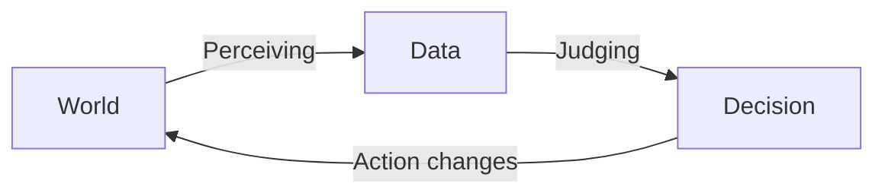
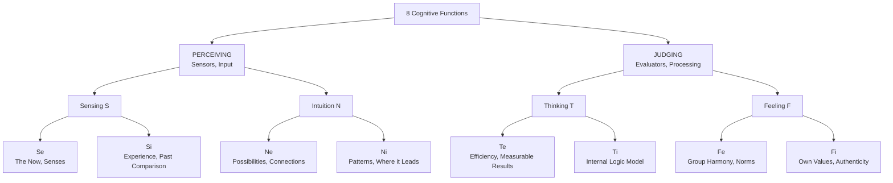
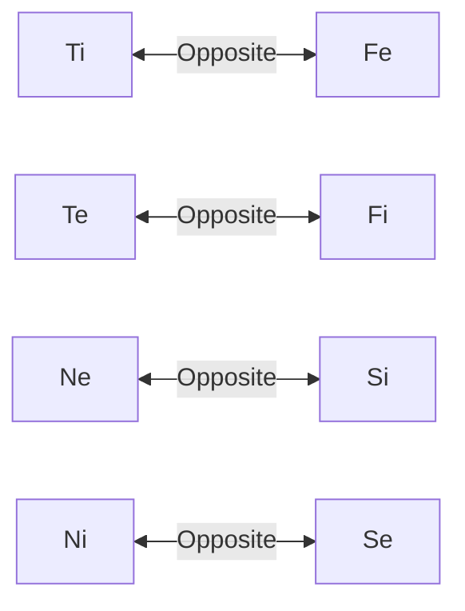
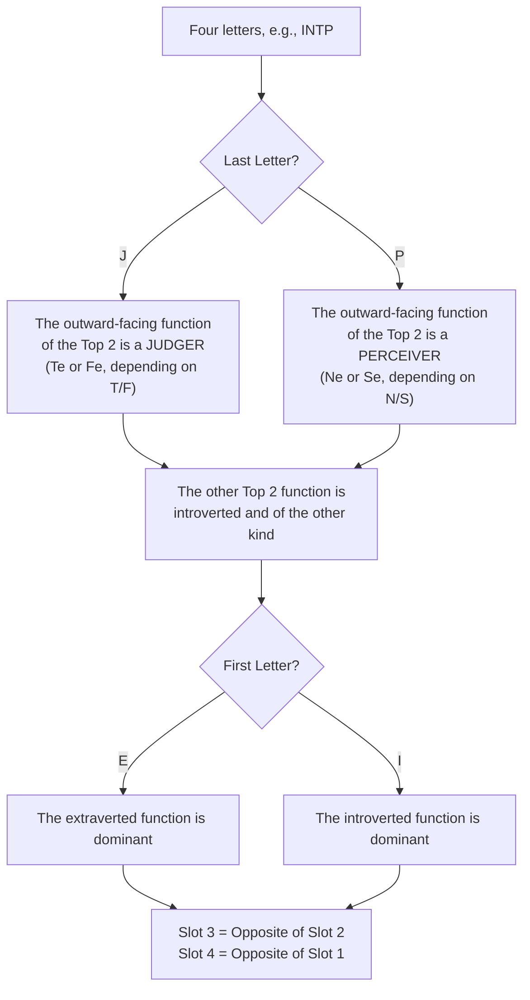
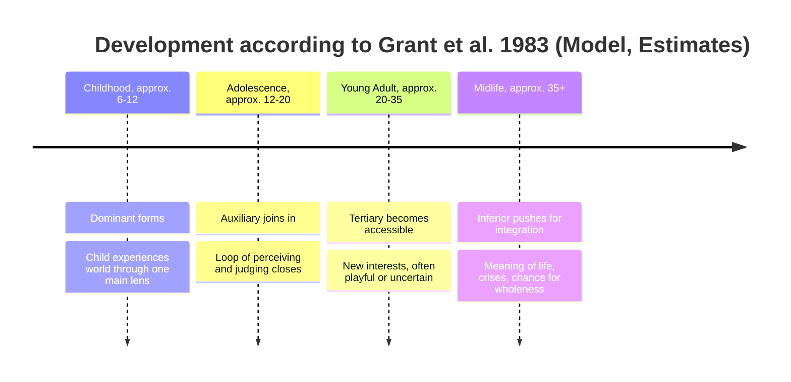
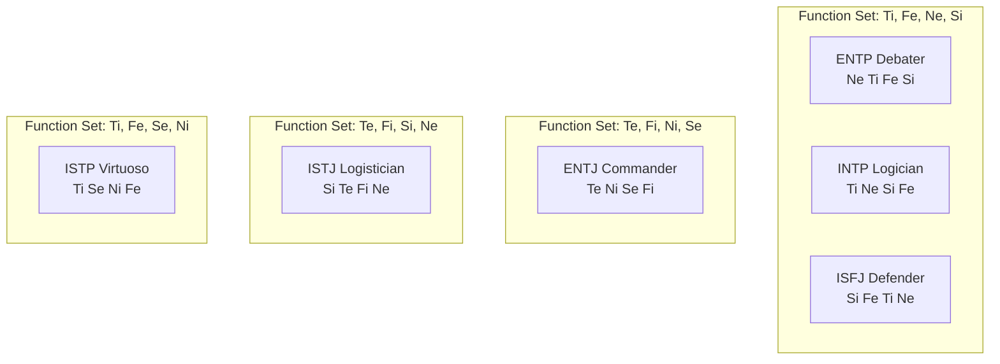

Hier ist die englische Übersetzung. Um dir später den Abgleich mit der chinesischen Version so einfach wie möglich zu machen, habe ich **alle Überschriften und Unterüberschriften streng durchnummeriert** (1.1, 1.2, etc.). Auch die Texte in den Diagrammen (Mermaid) wurden ins Englische übersetzt.

***

# Understanding Cognitive Functions

*What lies behind the four letters, how the model works, and why you can understand it without having to blindly believe in it.*

---

## 0. Before We Begin: What This Text Is (and What It Isn't)

Perhaps this sounds familiar: You’ve successfully guessed the MBTI types of many people around you. But when someone asks *why* an ENTP and an INTP supposedly share the exact same cognitive functions, while an INTP and an ENTJ share none at all, you draw a blank. Suddenly, abbreviations like Ti, Te, Ni, and Ne blur into an unreadable alphabet soup.

This text builds the model from the ground up, step by step. The goal: By the end, you should be able to **derive the system yourself**, rather than just memorizing it.

Right upfront, an honest disclaimer that applies to the entire text:

> Cognitive functions are a **theoretical model** dating back to C. G. Jung (1921) and later expanded by Isabel Briggs Myers and others. Only a part of this model is empirically supported; the larger part is not. I will clearly mark what is a **model assumption** and where there is solid **research**. A model can be useful without reflecting the objective truth in every detail. The crucial question is: Is it *internally consistent*, and does it help us see dynamics we might otherwise overlook?

---

## 1. The Basic Idea: Every Mind Has Two Tasks

Imagine you are standing at a road, waiting to cross.

1. You **see** a car, estimate its speed, and hear a second one behind the curve.
2. You **decide** to wait.

These are two fundamentally different activities. The first **takes in data**, the second **processes it into a judgment**. Jung called this:

- **Perceiving**: What is there? What information is coming in?
- **Judging**: What do I do with it? What is correct, important, or logical?

Once you understand this, you’ve already overcome the most common stumbling block: **Not all functions do the same thing.** Four act as sensors (perception), and four as evaluators (judgment). So, anyone confusing *Ne* and *Te* is confusing a sensor with an evaluator.

### 1.1. Two Ways to Perceive, Two Ways to Judge

According to Jung, there are two variations for each of these two tasks:

| Task | Variation | Guiding Question |
| --- | --- | --- |
| Perceiving | **Sensing (S)** | What is concretely and observably there? |
| Perceiving | **Intuition (N)** | What lies beneath, and what could it become? |
| Judging | **Thinking (T)** | Is it logical, consistent, and effective? |
| Judging | **Feeling (F)** | Is it valuable and humanly right? |

Important note: *Feeling* does not mean "emotional" here, but rather "judging based on values." An F-decision can be entirely calm and rationally justified.

### 1.2. The Direction: Inward or Outward

Each of these four variations can be directed **outward** (extraverted, e) or **inward** (introverted, i). The little letter (*i* or *e*) doesn't tell us if someone enjoys parties; it tells us **where the function gets its material or takes its standard from**.

2 Tasks × 2 Variations × 2 Directions = **8 Functions**.

---

## 2. The Eight Functions in Everyday Life

### 2.1. The Four Perceivers: Arriving in a Foreign City

| Function | What it notices |
| --- | --- |
| **Se** | The smell from the bakery, the cobblestones, the street music. It is entirely in the moment and reacts immediately. |
| **Si** | "This reminds me of Lisbon. Back then, the old town was too loud at night; I'll take a hotel on the outskirts." It compares new impressions with stored experiences. |
| **Ne** | "There’s a flea market over there. But we could also take the ferry, or just ride the bus to the last stop." It sees branches and possibilities. |
| **Ni** | "This neighborhood is gentrifying. In five years, it'll be expensive here." It condenses impressions into a clear direction, often without being able to name the exact path there. |

### 2.2. The Four Judgers: A Group Looking for a Restaurant

| Function | How it decides |
| --- | --- |
| **Te** | "Let's take the nearest place with over 4.5 stars that's still open. I'm making a reservation." Standard: external, verifiable criteria. |
| **Ti** | "Wait, what are our criteria anyway? Price, distance, and quality partially contradict each other." Standard: internal logical consistency. |
| **Fe** | "Anna doesn't eat meat, and Tom had a rough day. What works best for all of us?" Standard: the well-being of the group. |
| **Fi** | "I won't go to that place that uses factory farming, no matter how good the reviews are." Standard: one's own internal values. |

Every human uses all of these functions. The model simply states: **Everyone has a fixed ranking** in which they prefer to use them and consequently master them.

---

## 3. One Plan, Eight Reactions

Let's apply all eight functions to a concrete example. A family member presents a business plan: **Buying a remote estate to manufacture chocolate there.**

Pay attention to how the perceivers **notice** something, while the judgers **evaluate** something.

### 3.1. Perceivers: "What do I see in this plan?"

| Function | Typical Inner Reaction |
| --- | --- |
| **Se** | "The building, the intense smell of cocoa, customers tasting at the stand. I can see it right in front of me, and it feels alive." |
| **Si** | "How did it go for acquaintances who also started a business? What is safe and proven, and what are we giving up for this?" |
| **Ne** | "Why buy right away? You could rent a commercial kitchen first, sell only at festivals, or test an online shop." |
| **Ni** | "Remote means: long delivery routes, staff shortages, and dependency on summer festivals. I can already see where this ends in three years." |

### 3.2. Judgers: "What do I think of it?"

| Function | Typical Inner Reaction |
| --- | --- |
| **Te** | "What monthly revenue is realistic? What does the estate cost, including renovations? When is the break-even point?" |
| **Ti** | "The assumption that festival revenue can be linearly projected over the whole year is illogical, since festivals only happen in summer." |
| **Fe** | "How will the family react if I voice concerns? How do I wrap my criticism without discouraging him?" |
| **Fi** | "This is his absolute dream. It fits him, it's authentic—and in the end, that's what counts." |

None of these reactions are "wrong." Each sees a real part of the overall picture. We will return to this exact plan in Section 8.

---

## 4. From Building Blocks to the Stack: The Construction Rules

So far, we have eight individual building blocks. An MBTI type is essentially an **ordered selection of four** of these blocks—the so-called **Function Stack**:

1. **Dominant Function**: The main function; used most frequently and naturally.
2. **Auxiliary Function**: The supporter of the dominant.
3. **Tertiary Function**: Develops later, often used playfully or uncertainly.
4. **Inferior Function**: The weakest and least conscious function.

The order of these functions is not random. The model dictates strict rules. Important: These are **construction rules of the model**, not neurological laws of nature. I will contextualize where each rule comes from and why it makes sense within the theory.

### 4.1. Rule 1: The Top 2 Include One Perceiver and One Judger

*Origin: Jung himself (Psychological Types, 1921). He describes the auxiliary function as essentially different from the main function: If the main function is judging ("rational"), the auxiliary is perceiving ("irrational"), and vice versa.*

**Why it makes sense:** Remember the loop from Section 1. Two judgers at the top (e.g., Ti and Fe) would be like two evaluators without a sensor—judgments without fresh material. Two perceivers (e.g., Ne and Si) would be sensors without evaluation: an endless flood of data but no decision. The rule ensures that the two strongest functions form a complete, functional loop.

### 4.2. Rule 2: The Top 2 Include One Inward and One Outward Function

*Origin: Primarily formulated by Isabel Briggs Myers (Gifts Differing, 1980). This point is less explicit in Jung's original work.*

**Why it makes sense:** Two introverted functions at the top (e.g., Ti and Ni) would have no preferred channel to the outside world. Two extraverted functions (e.g., Ne and Te) would lack a protected space for internal processing. This rule ensures that every type has developed access to **both** worlds.

### 4.3. Rules 3 and 4: The Bottom Slots are the Exact Opposites

*Origin: Later authors, including Grant, Thompson & Clarke (1983) and John Beebe. Theoretical schools differ somewhat in this area.*

Every function has a fixed opposite pole: same task, other variation, other direction.

- **Tertiary** = Opposite of the Auxiliary
- **Inferior** = Opposite of the Dominant

**Why it makes sense:** The inferior function represents exactly those aspects that the dominant systematically ignores. Someone who primarily views the world through an internal logic model (Ti) has the least attention left for emotional group dynamics (Fe). Thus, the model describes personality as a compromise: A dominant strength always creates a blind spot on the opposite side.

### 4.4. A Consistency Check You Can Do Yourself

How many stacks do these rules allow for?

- **8** possibilities for the Dominant.
- For the Auxiliary, based on Rules 1 and 2, exactly **2** options remain (Example: If Ti is dominant, only Ne or Se can be auxiliary).
- Tertiary and Inferior are strictly determined by the opposite-pole rule.

8 × 2 = **16 Stacks**.
Simultaneously, there are exactly 16 letter combinations of I/E, S/N, T/F, and J/P. So the rules generate exactly as many stacks as the code can represent, and each combination corresponds to exactly one stack. While this doesn't prove the model's accuracy in the real world, it shows that it is **mathematically self-contained**.

### 4.5. Deriving the Stack from the Letters

You don't have to memorize the stacks. A short algorithm is all you need:

**Calculated using INTP as an example:**

1. **P**: The extraverted function is a perceiver. Because of the **N**, it is **Ne**.
2. The second Top 2 function must therefore be an introverted judger. Because of the **T**, it is **Ti**.
3. **I**: Since the type is introverted, the introverted function is dominant. So Slots 1 and 2 are **Ti, Ne**.
4. Opposite of Ne = **Si**, Opposite of Ti = **Fe**.

Result: **Ti – Ne – Si – Fe**.

The biggest trap lies in the last letter (J/P): For introverts, it describes the *auxiliary function*, not the dominant one. At their core, an INTP is a deep judging type (Ti), even though the outwardly visible "P" suggests otherwise.

### 4.6. How Empirically Reliable Is All This?

Here, a sober look at the facts is worthwhile:

- **The four scales** (E/I, S/N, T/F, J/P) are well-researched. They correlate significantly with four of the Big Five personality factors: E/I with Extraversion, S/N with Openness, T/F with Agreeableness, J/P with Conscientiousness (McCrae & Costa, 1989).
- **Twin studies** show that these scales have a distinct genetic component, similar to other personality traits (Bouchard & Hur, 1998). However, this only supports the *scales*, not the concept of functions or stacks.
- **Types as rigid categories** are scientifically poorly supported. Test scores are usually normally distributed and not bimodal (Bess & Harvey, 2002). If the test is repeated a few weeks later, a significant portion of subjects land on a different type (Pittenger, 1993, 2005). Someone right on the border between T and F simply "is" not definitively one or the other.
- **Function dynamics** (stacks, dominant, inferior, and the construction rules mentioned above) have virtually no empirical backing. An analysis of available data by Reynierse (2009) found no convincing evidence for this hierarchical system.

In short: The measurement of the letter scales is reasonably solid, but the architecture of the functions remains a **theory**. Read the rest of this text like the documentation of an IT system: The specifications are extremely logical and consistently built, but the extent to which the system exactly maps the human psyche remains unproven.

---

## 5. How the Stack Develops Over a Lifetime

The best-known theory on function development comes from Grant, Thompson & Clarke (1983). The age ranges given are only rough estimates.

### 5.1. Childhood: Looking Through a Single Lens

According to the model, children often seem very one-sided because primarily their dominant function is at work. An Ne-child restlessly jumps from idea to idea, an Si-child stubbornly insists on the familiar evening ritual, and a Ti-child drives parents crazy with endless "But why?" questions.

### 5.2. Adolescence: The Auxiliary Function Closes the Loop

During adolescence, the auxiliary function develops. It provides the dominant with exactly what it has been missing:

- **The missing task:** If the dominant is a judger, the auxiliary provides new data material. If the dominant is a perceiver, the auxiliary brings the ability to select and decide.
- **The missing direction:** Introverts gain a reliable channel to the outside world; extraverts gain a protected space for internal reflection.

Two examples:
- **An ENTP teen** (Ne dominant) had hundreds of ideas as a child without finishing any. Through Ti, he now gains evaluation criteria: He starts discarding ideas and building arguments. Debating becomes a sport.
- **An INTP teen** (Ti dominant) often brooded endlessly over a few topics as a child. With Ne, he now gathers food from the outside: new theories, hobbies, and interesting conversational partners. The inner thought system receives new material.

### 5.3. Adulthood: Tertiary and Inferior Functions

In adulthood, the theory suggests the tertiary function becomes more accessible—often through hobbies or new social roles. Later in life, the inferior function pushes into consciousness. Jung called this phase, where we integrate our neglected sides, *Individuation*.

**What research says about this:** The fact that people, on average, become more balanced as they age is empirically well documented. A large meta-analysis shows that traits like Conscientiousness, Agreeableness, and Emotional Stability steadily increase from young to middle adulthood (Roberts, Walton & Viechtbauer, 2006). However, there is no proof that this maturation occurs exactly in the **order of the function stack**. The model offers a nice narrative for a real effect, but no actual proof of the mechanism.

### 5.4. Stress: When the Inferior Function Takes the Wheel (The "Grip")

Naomi Quenk (2002) describes the so-called "Grip": Under extreme stress or deep exhaustion, the inferior function seizes control—but in an immature, often exaggerated form. You barely recognize yourself.

| Dominant | Inferior | How the "Grip" (Stress State) manifests |
| --- | --- | --- |
| Ne (ENTP) | Si | Hypochondria, fixation on bodily signals, petty clinging to details. |
| Ti (INTP, ISTP) | Fe | Sudden emotional outbursts, a bitter feeling of being disliked by everyone. |
| Si (ISFJ, ISTJ) | Ne | Catastrophe scenarios: "What if absolutely everything goes wrong?" |
| Te (ENTJ) | Fi | Complete overwhelm by emotions, deep self-doubt, and feelings of worthlessness. |
| Se (ESFP) | Ni | Dark premonitions, obsessive reading of "signs," tunnel vision on a negative future. |
| Ni (INTJ) | Se | Excessive sensory behavior: binge eating, shopping sprees, binge-watching series. |

---

## 6. Six Types in Direct Comparison

The following nicknames come from the platform *16Personalities*. (A quick side note: Paradoxically, 16Personalities doesn't actually use cognitive functions, but a Big Five-based scale model).

| Type | Nickname | Dominant | Aux | Tertiary | Inferior |
| --- | --- | --- | --- | --- | --- |
| **ENTP** | Debater | Ne | Ti | Fe | Si |
| **INTP** | Logician | Ti | Ne | Si | Fe |
| **ISFJ** | Defender | Si | Fe | Ti | Ne |
| **ISTJ** | Logistician | Si | Te | Fi | Ne |
| **ENTJ** | Commander | Te | Ni | Se | Fi |
| **ISTP** | Virtuoso | Ti | Se | Ni | Fe |

Before looking at the types closer, here is a fascinating observation that the four letters completely obscure:

- **ENTP, INTP, and ISFJ use the exact same four functions**, just weighted differently. The ISFJ is even the exact mirror image of the ENTP: What is at the very top for one is at the very bottom for the other.
- **INTP and ENTJ share no functions at all**, even though they both have "NT" in their code. The INTP thinks with Ti and perceives with Ne. The ENTJ thinks with Te and perceives with Ni. The superficial similarity of the letters here is highly misleading.

### 6.1. ENTP, The Debater: Ne – Ti – Fe – Si
- **Childhood (Ne):** A bubbling spring of ideas. "What if...?" Toys are repurposed, rules are critically questioned.
- **Adolescence (+Ti):** Ideas get evaluation criteria. The teenager argues passionately and may switch sides mid-conversation just to test the durability of the opposing view.
- **Adulthood (+Fe):** Learns to read moods, bring people along, and moderate.
- **Impact:** Brilliant starter, weak finisher. Inferior Si (routine, detailed work, body maintenance) remains an eternal construction site.

### 6.2. INTP, The Logician: Ti – Ne – Si – Fe
- **Childhood (Ti):** Wants to understand how the world works down to the last detail. Builds internal systems of order that remain mostly invisible to others.
- **Adolescence (+Ne):** Curiosity turns outward: many interests, thought experiments. Ne supplies, Ti sorts.
- **Adulthood (+Si):** Knowledge gets anchored deeper, routines become more reliable. Proven methods gain value.
- **Impact:** Quiet on the outside, a ceaseless analytical process on the inside. An INTP prefers silence over saying something inaccurate. Inferior Fe makes social conventions exhausting—small talk feels like an annoying protocol without clear specifications.

> **ENTP vs. INTP:** Same functions, reversed priorities. The ENTP *collects* possibilities first, then tests them. The INTP *builds* a logical model first, then seeks possibilities to test it. In conversation, this is immediately obvious: The ENTP thinks out loud and discards ideas while speaking. The INTP finishes thinking first, then speaks.

### 6.3. ISFJ, The Defender: Si – Fe – Ti – Ne
- **Childhood (Si):** Loves the familiar, remembers birthdays, preferences, and how things "have always been done."
- **Adolescence (+Fe):** Takes on caretaking roles, mediates conflicts, and accurately senses the mood in the room.
- **Adulthood (+Ti):** Learns to formulate personal arguments and set boundaries, rather than just sacrificing for others.
- **Impact:** Reliable, warm-hearted, and preserving. Under stress, inferior Ne manifests as negative mental cinema: a thousand possibilities, but only the worst ones.

### 6.4. ISTJ, The Logistician: Si – Te – Fi – Ne
- **Childhood (Si):** Order, clear rules, and proven ways provide stability.
- **Adolescence (+Te):** Organizes, plans, and completes tasks highly efficiently.
- **Adulthood (+Fi):** Personal values become more conscious, acting in the background as a moral compass.
- **Impact:** Dutiful and highly resilient. Sudden changes of plan or entirely open-ended situations (inferior Ne) create strong discomfort.

> **ISFJ vs. ISTJ:** Both have the same perceiver (Si) as their foundation. But while the ISFJ uses this experience to take care of **people** (Fe), the ISTJ uses it to optimize **processes and results** (Te).

### 6.5. ENTJ, The Commander: Te – Ni – Se – Fi
- **Childhood (Te):** Organizes the games, assigns roles, always wants things to move forward.
- **Adolescence (+Ni):** Develops foresight. "We're doing this now" turns into strategic thinking: "We do this so that X happens in two years."
- **Adulthood (+Se):** More presence in the here and now, enjoying competition, status, and experiences.
- **Impact:** Highly goal-oriented and strong in leadership. Personal feelings (inferior Fi) are often ignored and can break out uncontrollably upon exhaustion.

### 6.6. ISTP, The Virtuoso: Ti – Se – Ni – Fe
- **Childhood (Ti):** Unscrews, dismantles, experiments. Wants to grasp with their hands how mechanics work.
- **Adolescence (+Se):** Focus on physical skill, tools, and fast reactions (sports, motorcycles, crafts).
- **Adulthood (+Ni):** An almost intuitive sense of patterns. Often knows a machine is about to fail before it's measurable.
- **Impact:** Cool pragmatism. Extremely calm and capable of acting during crises. However, social expectations (inferior Fe) drain a lot of energy.

---

## 7. Why Some Decide Quickly and Others Weigh Endlessly

With knowledge of the stacks, we can explain a phenomenon that often causes friction in daily life: Why does Person A decide in five minutes, while Person B is still weighing options three weeks later?

According to the model, this depends on three factors:

1. **Where is the primary judger located?** If it is in Slot 1, passing judgment is at the forefront. If in Slot 2, extensive perception happens first before judgment follows.
2. **Is the judger extraverted or introverted?** Te and Fe use criteria from the outside world that are easily communicated (numbers, deadlines, group needs). Ti and Fi work with an internal standard that must first *feel consistent*—a process almost impossible to shortcut from the outside.
3. **What does the perceiver deliver?** Ni and Si *narrow* the focus (to a pattern or a known precedent). Ne and Se *open* it (to new options or new stimuli in the moment).

The last letter in the MBTI code immediately reveals what is visible on the outside: **J** (Judging) means you project your judging function outwardly. Others see you committing to things. **P** (Perceiving) means you show your perceiving function outwardly—you seem to keep your options open. (Incidentally, this is one of the more empirically solid points: The J/P scale correlates strongly with the Big Five factor Conscientiousness).

### 7.1. Decision Styles at a Glance

| Type | Style | Explanation from the Model |
| --- | --- | --- |
| **ENTJ** (Te–Ni) | Decisive and quick | Te uses hard external facts. Ni narrows the many options down to the single best path. Both forces push for quick closure. |
| **ISTJ** (Si–Te) | Brisk and conservative | Si provides the precedent ("This worked before"), Te ruthlessly applies checklists. |
| **ISFJ** (Si–Fe) | Fast for others, slow for self | Fe instantly knows what the group needs. But criteria for personal desires are lacking, as the internal standard (Ti) is weaker. |
| **ISTP** (Ti–Se) | Lightning-fast in action, sluggish with theory | Se delivers hard facts in real-time, Ti evaluates them instantly. In pure theory or abstract long-term plans, this concrete input is missing. |
| **INTP** (Ti–Ne) | Very thorough, often delayed | While the judger (Ti) is at the top, it demands a flawless model. Meanwhile, Ne constantly delivers new exceptions that torpedo a decision. |
| **ENTP** (Ne–Ti) | Hesitant to erratic | See detailed analysis below. |

### 7.2. Why ENTPs Have a Particularly Hard Time

For the ENTP, all three factors push toward "leaving it open," and the inferior function provides zero anchoring:

1. **The perceiver is at the top and permanently generates new options (Ne).** Deciding means that nine out of ten exciting paths must die. To Ne, this feels like a genuine loss.
2. **Judgment (Ti) is internal and only kicks in second.** There is no external rulebook to easily refer to. The internal argument must be perfectly consistent, but Ne constantly introduces new variables.
3. **Fe in Slot 3** adds a social layer: How will others take this? That means even more variables.
4. **Si (Experience) is missing as an anchor.** Si would say: "We did it this way last time, let's do it again." Since Si is weakest for the ENTP, every trivial decision must essentially be philosophically re-justified from scratch.

Important: ENTPs decide extremely fast when options are **clear, reversible, or limited by external pressure** (e.g., a hard deadline). The agony only comes with open-ended decisions lacking deadlines and containing infinite possibilities.

### 7.3. Practical Levers (Not Just for ENTPs)

If you struggle to make decisions, you can deliberately offset weaknesses in your stack through external frameworks:

| Lever | What it compensates for in the model |
| --- | --- |
| Set an external deadline | Replaces the missing external criterion (Te/Fe substitute). |
| Allow a maximum of three options | Brakes the endless Ne-machine. |
| Frame it as an "experiment" | Calms Ne: Nothing is final, we're just testing it for four weeks. |
| Define "good enough" | Gives Ti a clear cut-off point, instead of endlessly seeking the ideal solution. |
| Talk to a Te-user | Borrows the pragmatic focus on achievable external goals. |

---

## 8. Case Study: A Family and a Chocolate Business Plan

Finally, let's apply the model to real people. The types are self- or peer-assessments (for the cousin, an educated guess).

| Person | Type | Nickname | Stack |
| --- | --- | --- | --- |
| Me | ENTP | Debater | Ne – Ti – Fe – Si |
| Mother | ISFJ | Defender | Si – Fe – Ti – Ne |
| Father | INTJ | Architect | Ni – Te – Fi – Se |
| Cousin | ESFP | Entertainer | Se – Fi – Te – Ni |

**The Situation:** The cousin (ESFP) is very successfully selling goods at festivals, has lots of customer contact, and has hired his first employees. Now he presents his business plan: He wants to buy a remote estate to manufacture chocolate year-round.
My father and I are highly skeptical. The numbers look glossed over, potential risks (staff shortages in rural areas) are ignored, and the danger of losing his current disability pension isn't even mentioned in the plan.

### 8.1. What the Model Says About the Plan

If you read the ESFP's stack from top to bottom, the plan explains itself:

- **Se (Dominant)** explains his success so far. Presence on-site, the feel for the moment, and the customers—this isn't a weakness of the plan; it's its foundation.
- **Fi (Auxiliary)** makes the core emotional decision: Having his own manufactory feels right and authentic. It's his life's dream. Criticism of the plan inevitably feels like criticism of him as a person.
- **Te (Tertiary)** is present, but not serving to coldly *test* the idea here. Tertiary functions often act as henchmen for the top two: The numbers are conjured up to *justify* the decision (already made by Fi). This explains why the plan looks "glossed over."
- **Ni (Inferior)** is the blind spot. Ni would ask: "Where are we in five years? What am I missing?" Seasonal dependency, long delivery routes, pension loss—these are typical strategic Ni-questions, for which he currently has no antenna.

### 8.2. Why Father and I React So Strongly

Comparing the stacks of the cousin and the father makes the conflict mathematically visible:

| Slot | Cousin (ESFP) | Father (INTJ) |
| --- | --- | --- |
| 1 | **Se** | **Ni** |
| 2 | **Fi** | **Te** |
| 3 | Te | Fi |
| 4 | Ni | Se |

The father (INTJ) is the **exact psychological opposite** of the cousin. What the cousin lacks (Ni, Te) are the absolute core competencies of the father. The father immediately demands robust numbers (Te) and long-term forecasts (Ni). At the same time, the father completely underestimates what the cousin does best: direct customer contact in the here and now (Se).

As an ENTP, I reach the same skeptical conclusion via a different path:
- **Ne** shouts: "Why buy right away? Let's rent first, launch an online shop, or test a winter season!"
- **Ti** finds the logical gaps: "Projecting summer festival revenue onto the winter is mathematically inconsistent."

And my mother? As an ISFJ, she focuses on safety and the proven (**Si**)—and the secure pension is exactly that. Concurrently, she wants to preserve family harmony (**Fe**). She is likely the only one in the room who knows *how* to voice these concerns without the cousin storming out offended.

### 8.3. Practical Takeaways

The model doesn't provide a solution for the business plan, but it offers an excellent guide for communication. The critique must be packaged in the **language of the cousin's top functions (Se and Fi)**:

- **Respect Fi:** Never attack the dream, only the path to get there. ("I really want this to succeed" instead of "This will never work").
- **Address Se:** Make abstract Ni-risks tangible. "Let's play through next February. No festivals, we have to heat the place, pay two salaries. What exactly happens in the bank account?"
- **Use Ne as a compromise:** Suggest small test balloons that keep the dream alive but lower the risk (rent first, then buy).
- **Outsource Te:** Hand over the legal pension question to objective startup consultants. A neutral expert will be accepted by Fi much more easily than the critical uncle.

**Reality Check:** Overly optimistic business plans are not an exclusive MBTI phenomenon. A study showed that founders almost always drastically overestimate their own chances of success (Cooper, Woo & Dunkelberg, 1988). The tendency to chronically underestimate time and costs (*Planning Fallacy*) is also a well-documented psychological standard (Buehler, Griffin & Ross, 1994).
So, the type model doesn't primarily explain *that* someone is too optimistic. However, it excellently explains *where exactly* the blind spots lie and how to have a constructive conversation about them.

---

## 9. The Most Important Points in Eight Sentences

1. There are **four Perceivers** (Se, Si, Ne, Ni) that gather information, and **four Judgers** (Te, Ti, Fe, Fi) that evaluate it.
2. Whether a function is introverted (i) or extraverted (e) simply indicates **where** it seeks its standard or data material.
3. The Top 2 of a function stack always consist of **one Perceiver and one Judger**—one directed inward, the other outward.
4. These mathematically logical construction rules result in exactly **16 Stacks** (Types).
5. For Introverts, the last letter (J/P) does not reveal the dominant function, but the **auxiliary function**. (An INTP is fundamentally a "Judging" type).
6. According to theory, functions develop in a fixed sequence (Dominant, Aux, Tertiary, Inferior). That we mature is measurable; that it happens exactly this way is empirically unproven.
7. How quickly someone makes decisions depends on the **combination** of their top functions (focus on outside/inside, narrowing or opening perceiver).
8. Use the MBTI model not as an absolute scientific diagnosis, but as a **communicative map**: It helps tremendously in understanding who sees which aspects and who overlooks what.

---

## 10. Sources and Further Reading

**Theory**
- Jung, C. G. (1921). *Psychologische Typen*. Rascher. [English: *Psychological Types*]
- Myers, I. B. & Myers, P. B. (1980). *Gifts Differing: Understanding Personality Type*. Davies-Black.
- Grant, W. H., Thompson, M. & Clarke, T. E. (1983). *From Image to Likeness: A Jungian Path in the Gospel Journey*. Paulist Press.
- Beebe, J. (2016). *Energies and Patterns in Psychological Type*. Routledge.
- Quenk, N. L. (2002). *Was That Really Me? How Everyday Stress Brings Out Our Hidden Personality*. Davies-Black.

**Empirics & Research**
- McCrae, R. R. & Costa, P. T. (1989). Reinterpreting the Myers-Briggs Type Indicator from the perspective of the five-factor model of personality. *Journal of Personality, 57*(1), 17–40.
- Bouchard, T. J. & Hur, Y.-M. (1998). Genetic and environmental influences on the continuous scales of the Myers-Briggs Type Indicator: An analysis based on twins reared apart. *Journal of Personality, 66*(2), 135–149.
- Bess, T. L. & Harvey, R. J. (2002). Bimodal score distributions and the Myers-Briggs Type Indicator: Fact or artifact? *Journal of Personality Assessment, 78*(1), 176–186.
- Pittenger, D. J. (1993). Measuring the MBTI … and coming up short. *Journal of Career Planning and Employment, 54*(1), 48–52.
- Pittenger, D. J. (2005). Cautionary comments regarding the Myers-Briggs Type Indicator. *Consulting Psychology Journal, 57*(3), 210–221.
- Reynierse, J. H. (2009). The case against type dynamics. *Journal of Psychological Type, 69*(1), 1–21.
- Roberts, B. W., Walton, K. E. & Viechtbauer, W. (2006). Patterns of mean-level change in personality traits across the life course: A meta-analysis of longitudinal studies. *Psychological Bulletin, 132*(1), 1–25.
- Cooper, A. C., Woo, C. Y. & Dunkelberg, W. C. (1988). Entrepreneurs' perceived chances for success. *Journal of Business Venturing, 3*(2), 97–108.
- Buehler, R., Griffin, D. & Ross, M. (1994). Exploring the "planning fallacy": Why people underestimate their task completion times. *Journal of Personality and Social Psychology, 67*(3), 366–381.
